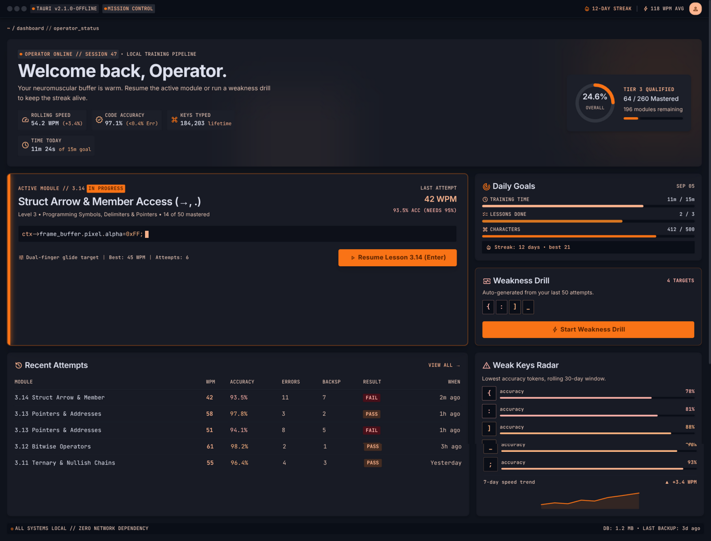
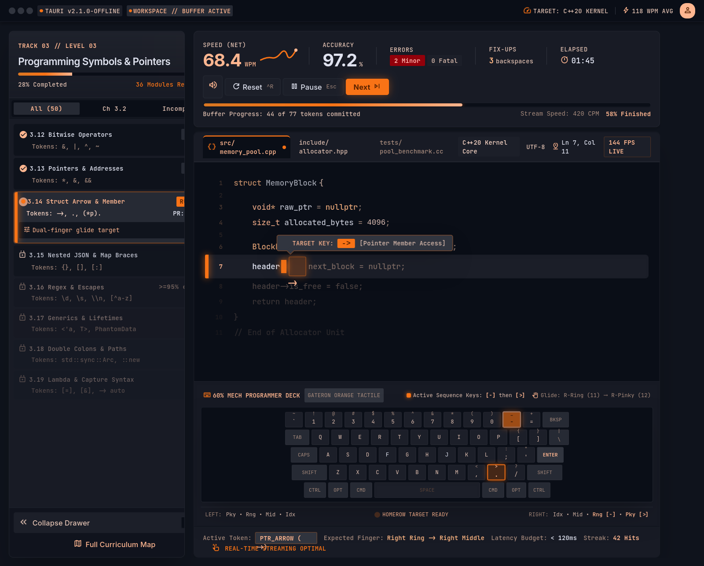
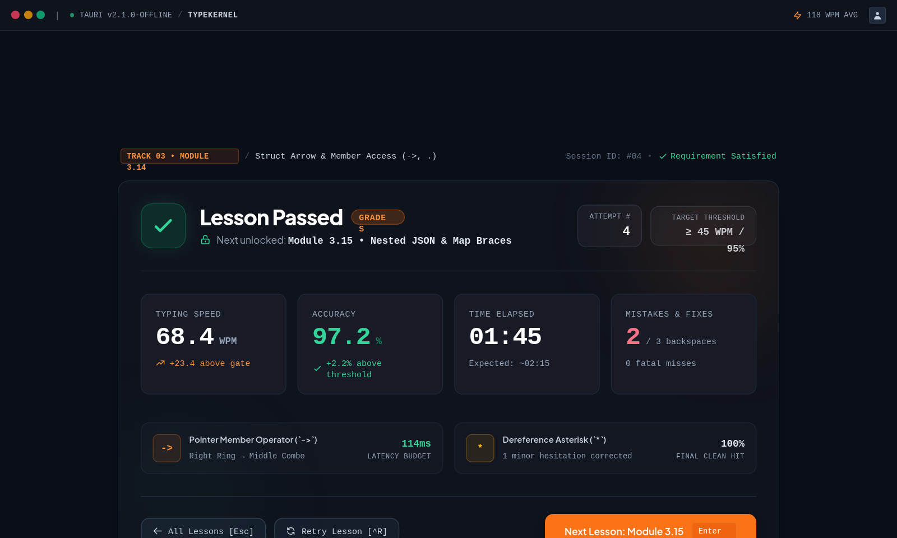
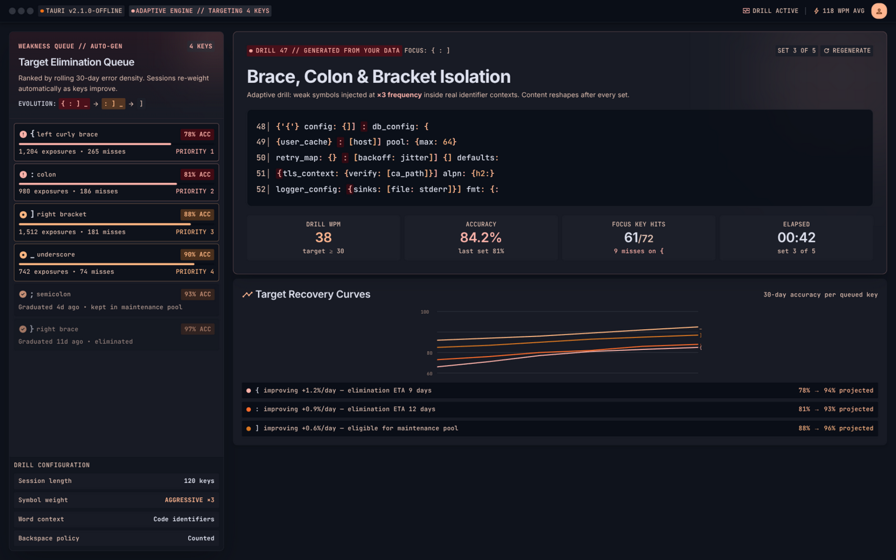
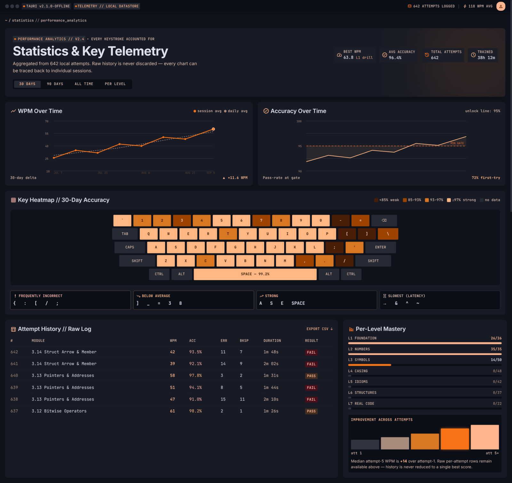
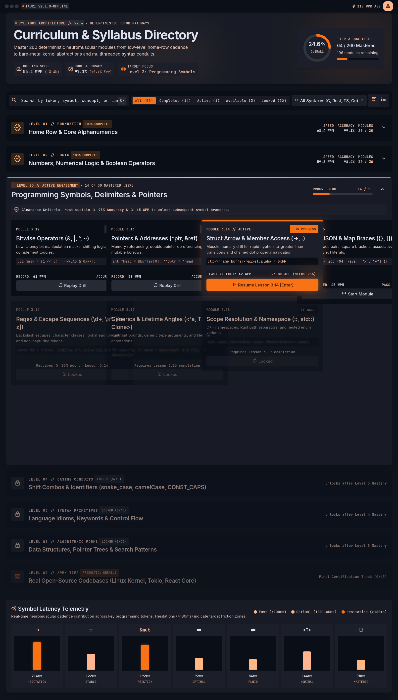
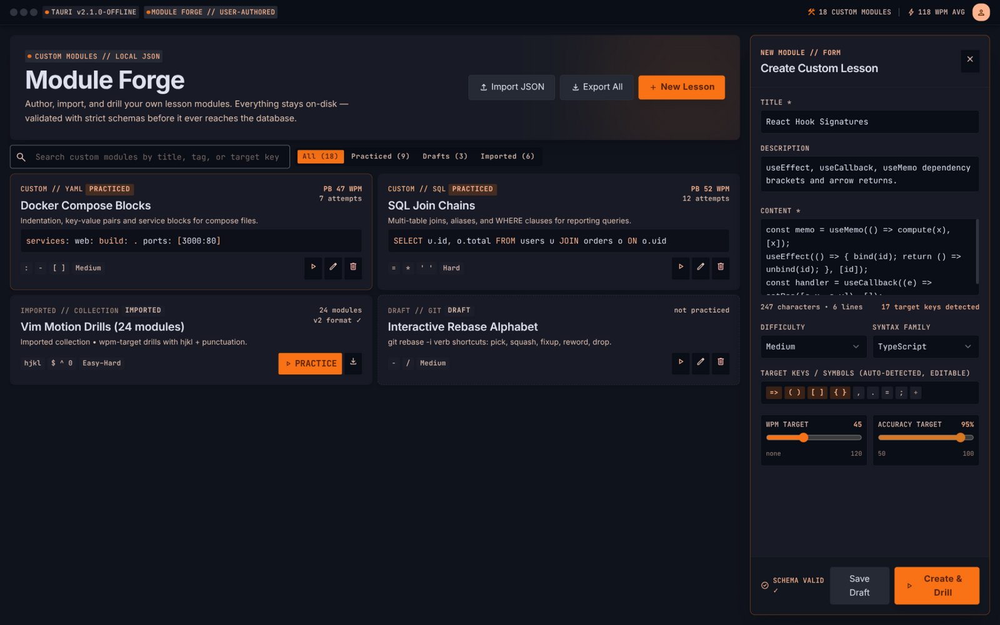
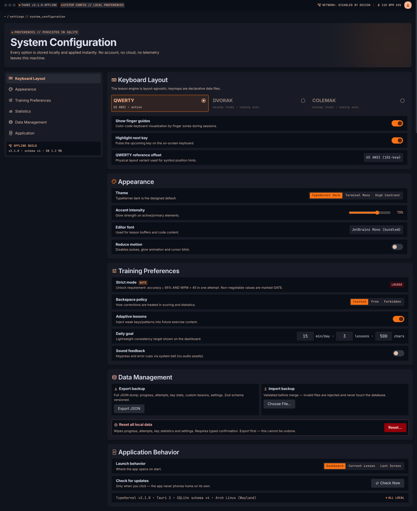

# TypeKernel

An **offline-first desktop trainer for coding touch-typing**: a 260-lesson
progressive curriculum with programming-symbol focus, unlock-gated
progression, attempt-level history, adaptive weakness training, and custom
lessons. Local SQLite persistence only — no backend, no accounts, no cloud.

Built with **Tauri v2 (Rust) + React + TypeScript + Drizzle ORM/SQLite**.



## Highlights

- **260-lesson curriculum** — generated, curated, symbol-heavy; you unlock
  the next lesson by passing the current one (accuracy ≥ 95 and WPM > 45 in
  the same attempt).
- **Real-time metrics** — WPM, accuracy, error stream while you type, with
  attempt-level history that is never reduced to a best score.
- **Adaptive intelligence** — key heatmap, weakness analyzer, and evolving
  weakness drills targeting your worst keys and bigrams.
- **Custom lessons** — author, practice, and share via validated JSON
  import/export; progress backups included.
- **Daily consistency** — editable daily goal, streaks, and a consistency
  view.
- **Fully offline** — nothing phones home. The only network-adjacent action
  is a *manual* "Check for Updates" that opens the releases page in your
  browser.

| | | |
|---|---|---|
|  |  |  |
|  |  |  |
|  | | |

## Install

### Windows (.exe Setup Installer)

1. Download the latest installer: `TypeKernel_<version>_x64-setup.exe` from GitHub Releases.
2. Run the installer. It installs TypeKernel, creates Start Menu and desktop shortcuts, and registers in Windows Apps.
3. Launch TypeKernel from your Start Menu or desktop.

> A portable executable (`typekernel.exe`) is also available if you prefer running without installation.

### Linux (Arch Linux & others)

#### AppImage

```sh
chmod +x TypeKernel_1.0.0_amd64.AppImage
./TypeKernel_1.0.0_amd64.AppImage
```

Requires `gtk3` and `webkit2gtk-4.1` (present on any desktop Arch install).
If FUSE is unavailable, run with `--appimage-extract-and-run`.

#### pacman package

```sh
sudo pacman -U typekernel-bin-1.0.0-1-x86_64.pkg.tar.zst
```

Installs `/usr/bin/typekernel`, a desktop entry, and hicolor icons — a
native-feel package with full pacman integration (`pacman -R` removes it
cleanly).

#### AUR

AUR submission is planned for after 1.0 (see `packaging/aur/` for the
scaffold and submission checklist).

## Data & privacy

- **Linux**: All data lives under your app data dir (`$XDG_DATA_HOME` /
  `$XDG_CONFIG_HOME`, `com.typekernel.app`) — settings, DB, backups. Pre-1.0
  Linux dev installs are adopted automatically on first boot.
- **Windows**: All data lives under `%APPDATA%\com.typekernel.app` (`typing_trainer.db`).
- Uninstalling leaves your data in place; the in-app reset flow wipes it.

## Build from source

### Linux
Prereqs: Node ≥ 22, pnpm, Rust (stable), `gtk3`, `webkit2gtk-4.1`, and the
Tauri Linux prerequisites.

```sh
pnpm install
pnpm tauri dev        # develop
pnpm run build:linux  # → src-tauri/target/release/bundle/appimage/*.AppImage
pnpm test             # TypeScript unit/integration suites
cd src-tauri && cargo test
```

### Windows
Prereqs: Node ≥ 22, pnpm, Rust (stable with `x86_64-pc-windows-msvc`), and Visual Studio C++ Build Tools.

```powershell
pnpm install
pnpm tauri dev          # develop
pnpm run build:windows  # → src-tauri/target/release/bundle/nsis/*-setup.exe
# Or use the helper script:
.\scripts\build-windows.ps1
```

See [docs/release/RELEASE_CHECKLIST.md](docs/release/RELEASE_CHECKLIST.md)
for the per-release steps (version bumps, packaging, smoke matrix) and
[packaging/arch](packaging/arch/) for the Arch PKGBUILD.

## Documentation

- [PRD](PRD-Offline-Coding-Touch-Typing-Trainer.md) — product requirements
- [DESIGN.md](DESIGN.md) — visual design language
- [plans/](plans/) — phase-by-phase implementation plans (1–9)
- [docs/PRD_CHECKLIST.md](docs/PRD_CHECKLIST.md) — PRD compliance tracker

## License

TBD before public distribution — see `packaging/arch/PKGBUILD`.
