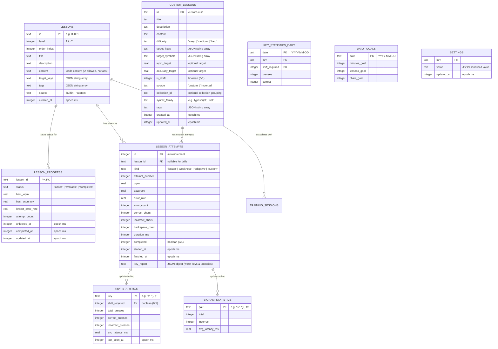
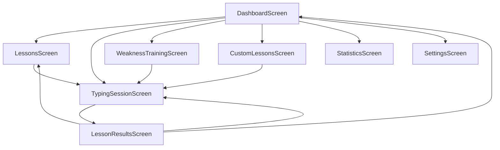

# TypeKernel — Complete Project & Architecture Guide

> **Target Audience:** LLM agents starting a new session, developers, and maintainers.  
> **Purpose:** Provide an exhaustive, single-source-of-truth technical overview of the TypeKernel codebase, including product goals, architecture, database schemas, engine mechanics, directory breakdown, and development invariants.

---

## 1. Executive Summary & Product Goals

**TypeKernel** is an offline-first, native desktop application engineered specifically for **programmers to master touch-typing on code and developer syntax**. 

Unlike conventional touch-typing tutors that train on prose or literature, TypeKernel focuses on the unique mechanical demands of software engineering:
- Heavy use of punctuation, brackets, braces, and operators: `{}`, `[]`, `()`, `<>`, `=>`, `&&`, `||`, `!=`, `;`, `::`, `->`, `@`, `$`, `%`, etc.
- Mixed capitalization paradigms: `camelCase`, `PascalCase`, `snake_case`, `SCREAMING_SNAKE_CASE`, and `kebab-case`.
- Language keywords, semantic identifiers, and real-world multi-language code snippets (JS, TS, HTML, CSS, SQL, JSON, Bash, Git).
- Strict, unlock-gated progression to guarantee muscle memory before advancing.
- Deep, attempt-level analytics and adaptive weakness training that detects struggling keys and bigrams and generates targeted drills.

### Core Product Guarantees
1. **100% Offline-First:** Zero backend, zero telemetry, zero accounts, zero cloud dependencies. No runtime network requests.
2. **Local Persistence:** Fully backed by a local SQLite database in WAL mode using versioned migrations.
3. **Immutable History:** Attempt metrics are append-only. The app never overwrites historical attempt metrics with "best scores".
4. **Deterministic Progression:** 260 curated lessons across 7 progressive levels. Unlocking requires passing both speed and accuracy thresholds simultaneously in a single attempt.
5. **Adaptive Intelligence:** Automatic tracking of per-key accuracy, latency, and bigram error rates, feeding visual heatmaps and dynamic weakness drill generators.

---

## 2. Technical Stack & Tooling

| Component | Technology | Role / Details |
|---|---|---|
| **Desktop Shell** | **Tauri v2** (Rust 2021) | Native OS integration, window lifecycle, single-instance lock, file dialogues, and native SQLite driver bridge. |
| **Frontend Framework** | **React 19** + **TypeScript 5.8** | Component rendering, hooks, type safety (`strict: true`). |
| **Build Tooling** | **Vite 7** | Fast HMR in dev and production bundle optimization. |
| **Styling & Theme** | **Tailwind CSS v4** (`@tailwindcss/vite`) | TypeKernel dark theme system: orange accent (`#f97316`), Material-3 style container surfaces, Inter (UI) & JetBrains Mono (code). |
| **State Management** | **Zustand 5** | Lightweight reactive stores for transient state (live session telemetry, screen routing, daily goals, preferences). |
| **Data Layer & ORM** | **SQLite** + **Drizzle ORM** | Schema definition (`sqlite-core`), type-safe queries, migration generation (`drizzle-kit`), executed via `tauri-plugin-sql`. |
| **Validation & Schemas** | **Zod 4** | Runtime validation contracts at all I/O and database boundaries (lessons, attempts, imports/exports, settings). |
| **Charts & Analytics** | **Recharts 3** + Custom SVG | WPM/Accuracy trendlines, key latency distributions, key heatmaps, consistency heat strips. |
| **Icons & Fonts** | **Lucide React** + Self-hosted Fonts | Local offline font files (Inter, JetBrains Mono) and SVG icons. |
| **Test Suite** | **Vitest 5** + **Cargo Test** | Unit and integration tests for engine, curriculum, database repos, adaptive algorithms, and Rust backend. |
| **Packaging** | **AppImage**, **Pacman `.pkg.tar.zst`**, **AUR** | Native Linux desktop packaging for Arch and standard distributions. |

---

## 3. Directory & File Structure

```
typing-trainer/
├── .vscode/                     # Editor configurations
├── docs/                        # Project documentation & audits
│   ├── perf/                    # Performance budgets and audit logs
│   │   └── PERF_BUDGET.md       # Memory, bundle size, and throughput limits
│   ├── release/                 # Release procedures and verification matrices
│   │   ├── RELEASE_CHECKLIST.md # Step-by-step release checklist
│   │   ├── offline-audit.md     # Proof of 100% offline compliance
│   │   └── platform-verification.md # Linux / Wayland / X11 test records
│   ├── PRD_CHECKLIST.md         # PRD compliance tracking sheet
│   └── PROJECT_GUIDE.md         # THIS FILE: Master technical guide for developers and LLMs
├── packaging/                   # Packaging scripts and metadata
│   ├── arch/                    # Arch Linux PKGBUILD and desktop integration files
│   └── aur/                     # AUR submission checklist and template
├── plans/                       # Phase-by-phase implementation plans (Phase 1 to 9)
│   ├── MAIN_PLAN.md             # Master roadmap
│   ├── PHASE_2_PLAN.md .. PHASE_9_PLAN.md
├── public/                      # Static assets bundled with the app (fonts, icons)
├── screens/                     # Reference UI designs & HTML mockups for all 8 screens
│   ├── all_lessons_typekernel/
│   ├── current_lesson_typekernel/
│   ├── custom_lessons_typekernel/
│   ├── dashboard_typekernel/
│   ├── lesson_results_typekernel/
│   ├── settings_typekernel/
│   ├── statistics_typekernel/
│   └── weakness_training_typekernel/
├── scripts/                     # Utility scripts
│   └── perf-budget.mjs          # Automated build & bundle size budget auditor
├── src/                         # React / TypeScript Application Source
│   ├── components/              # Shared UI components
│   │   ├── ConsistencyStrip.tsx # 14-day / 90-day activity consistency heatmap strip
│   │   ├── FormPrimitives.tsx   # Custom inputs, toggles, textareas, buttons
│   │   ├── KeyHeatmap.tsx       # Full interactive QWERTY visual heatmap
│   │   ├── KeyHeatmapCompact.tsx# Condensed heatmap widget
│   │   ├── KeyboardVisualization.tsx # Live interactive virtual keyboard during sessions
│   │   ├── MasteryGauge.tsx     # Radial circular progress gauge
│   │   ├── Modal.tsx            # Accessible modal dialogue overlay
│   │   ├── NavSidebar.tsx       # Collapsible navigation sidebar
│   │   ├── Shell.tsx            # Main application layout wrapper
│   │   ├── Sparkline.tsx        # Inline mini trend SVG
│   │   ├── SparklineChart.tsx   # Recharts-based telemetry chart
│   │   ├── StatCard.tsx         # Standardized KPI summary card
│   │   └── TopBar.tsx           # Status bar with offline badge, WPM meter, screen title
│   ├── content/                 # 260-Lesson Curriculum & Level Generators
│   │   ├── levels/              # Individual level generators
│   │   │   ├── level1.ts        # L1: Fundamentals (Home, Top, Bottom rows)
│   │   │   ├── level2.ts        # L2: Numbers & Digit combinations
│   │   │   ├── level3.ts        # L3: Programming Symbols & Operators
│   │   │   ├── level4.ts        # L4: Shift keys & Case naming conventions
│   │   │   ├── level5.ts        # L5: Programming Vocabulary & Keywords
│   │   │   ├── level6.ts        # L6: Syntax Patterns & Control Structures
│   │   │   └── level7.ts        # L7: Real Code (JS, TS, HTML, CSS, SQL, JSON, Bash, Git)
│   │   ├── build.ts             # Generator compilation utilities
│   │   ├── curriculum.test.ts   # Curriculum validation & coverage test suite
│   │   ├── index.ts             # Curriculum registry and accessor helpers
│   │   └── types.ts             # Level metadata and lesson structure interfaces
│   ├── lib/                     # Core Business Logic, Engine, DB, and Utilities
│   │   ├── cn.ts                # Class name merging utility (clsx / tailwind-merge)
│   │   ├── curriculum/          # Progression rules, unlock evaluator, and DB seeding
│   │   │   ├── progressService.ts # Lesson progress tracking and unlock pipeline
│   │   │   ├── rules.ts         # Unlock gate validation rules (Acc >= 95 & WPM > 45)
│   │   │   └── seed.ts          # Database seed script for built-in lessons
│   │   ├── customLessons/       # Custom user lesson domain logic
│   │   │   └── domain.ts        # Auto-detection of target keys, symbols, and difficulty
│   │   ├── db/                  # SQLite Database Client & Repositories
│   │   │   ├── client.ts        # Tauri SQL plugin client wrapper & migration runner
│   │   │   ├── repositories.ts  # Type-safe CRUD functions for all 8 tables
│   │   │   ├── schema.ts        # Drizzle ORM SQLite schema definition
│   │   │   └── testing.ts       # In-memory mock database for unit tests
│   │   ├── engine/              # Pure Event-Sourced Typing Engine
│   │   │   ├── engine.ts        # Session reducer, character evaluation, event fold
│   │   │   ├── metrics.ts       # Pure metric selectors (WPM, Accuracy, Error Rate)
│   │   │   └── types.ts         # Engine state interfaces, event types, session options
│   │   ├── intelligence/        # Adaptive Learning & Weakness Engine
│   │   │   ├── adaptiveGenerator.ts # Generates text injected with user's weak keys
│   │   │   ├── analyzer.ts      # Statistical analyzer over key attempts & rollups
│   │   │   ├── drillService.ts  # Dynamic evolving weakness drill generator
│   │   │   └── heatmap.ts       # Heatmap color scale calculator
│   │   ├── io/                  # Import, Export & Backup Subsystem
│   │   │   ├── exporter.ts      # JSON & CSV serialization (lessons, backups, logs)
│   │   │   ├── exportSchema.ts  # Zod schema contracts for import/export JSON files
│   │   │   ├── fileIo.ts        # Tauri native file dialog and disk read/write
│   │   │   └── importer.ts      # Validated deserialization & database restoration
│   │   ├── layout/              # Layout-Agnostic Keyboard Definitions
│   │   │   ├── fingers.ts       # Finger assignment mapping
│   │   │   ├── keymap.ts        # Key mapping abstractions and types
│   │   │   └── qwerty.ts        # Physical QWERTY key matrix definition
│   │   ├── stats/               # Aggregation & Rollup Services
│   │   │   ├── dailyGoalsRepo.ts# Daily goal persistence
│   │   │   ├── dailyService.ts  # Daily progress, streaks, and consistency computation
│   │   │   ├── format.ts        # Time, date, and metric formatting helpers
│   │   │   ├── progressService.ts # Overall curriculum statistics aggregation
│   │   │   └── weaknessService.ts # Weakness summary service
│   │   ├── format.ts            # Global formatting utilities
│   │   ├── schemas.ts           # Zod domain schemas (Single source of truth)
│   │   └── screens.ts           # Screen IDs and routing definitions
│   ├── screens/                 # 8 Application Screens
│   │   ├── CustomLessonsScreen.tsx   # Custom lesson creator, editor, and catalog
│   │   ├── DashboardScreen.tsx       # Main dashboard: KPIs, continue card, streak, heatmaps
│   │   ├── LessonResultsScreen.tsx   # Post-attempt score, gate evaluation, and key spotlight
│   │   ├── LessonsScreen.tsx         # Full 260-lesson curriculum browser
│   │   ├── SettingsScreen.tsx        # Preferences, layout, backup/restore, data wipe
│   │   ├── StatisticsScreen.tsx      # In-depth analytics, Recharts curves, raw attempt log
│   │   ├── TypingSessionScreen.tsx   # Active typing arena with live telemetry & keyboard
│   │   └── WeaknessTrainingScreen.tsx# Adaptive drills targeting weakest keys/bigrams
│   ├── stores/                  # Zustand Reactive State Stores
│   │   ├── useCurriculumStore.ts     # Curriculum list and per-level progress state
│   │   ├── useCustomLessonsStore.ts  # Custom lessons list and draft management
│   │   ├── useDailyGoalsStore.ts     # Daily training goals and streaks
│   │   ├── useSessionStore.ts        # Active typing session state and engine bridge
│   │   ├── useSettingsStore.ts       # User preferences and app settings
│   │   ├── useStatsStore.ts          # Aggregate statistics and attempt history
│   │   └── useUiStore.ts             # Navigation router and screen parameter state
│   ├── App.tsx                  # Root application router and layout shell
│   ├── main.tsx                 # React entry point
│   └── styles.css               # Tailwind CSS imports and custom token directives
├── src-tauri/                   # Rust Backend & Tauri Configuration
│   ├── capabilities/            # Tauri v2 security capabilities
│   │   └── default.json         # Scoped permissions for fs, dialog, sql, opener
│   ├── migrations/              # Versioned SQL migrations generated by drizzle-kit
│   │   ├── 0000_previous_pestilence.sql # Initial 8 PRD tables
│   │   ├── 0001_gorgeous_ben_grimm.sql  # Attempt key spotlight column
│   │   ├── 0002_tidy_liz_osborn.sql     # Daily rollups & bigram statistics
│   │   └── 0003_omniscient_ben_grimm.sql# Custom lesson lifecycle & metadata
│   ├── src/
│   │   ├── lib.rs               # App startup, legacy data migration, plugin registration
│   │   └── main.rs              # Rust binary entrypoint
│   ├── Cargo.toml               # Rust dependencies
│   └── tauri.conf.json          # Tauri configuration (window, bundle, plugins)
├── drizzle-kit.config.ts        # Drizzle migration generator config
├── index.html                   # HTML host template
├── package.json                 # Node dependencies and NPM scripts
├── tsconfig.json                # TypeScript project configuration
├── vite.config.ts               # Vite bundler configuration
└── vitest.config.ts             # Vitest test configuration
```

---

## 4. Database Schema & Persistence Architecture

The database is a local SQLite file named `typing_trainer.db` placed in the OS app-config directory (e.g. `~/.config/com.typekernel.app/typing_trainer.db` on Linux).

Migrations are versioned and managed through **Drizzle Kit** (`pnpm db:generate`), generating SQL files in `src-tauri/migrations/`. They are applied automatically and idempotently on startup by `tauri-plugin-sql`.

### Core Tables & Entity Relations



### Critical Database Rules
1. **Append-Only Attempts:** The `lesson_attempts` table is an append-only ledger. Attempt rows and their metric columns are **never** `UPDATE`d or deleted during normal application flow.
2. **Nullable `lesson_id` on Attempts:** Drills generated dynamically (weakness & adaptive) have `lesson_id = NULL` and `kind = 'weakness' | 'adaptive'`. Their metrics update key statistics and daily streaks, but **never** modify `lesson_progress`.
3. **First-Boot Legacy Adoption:** In `src-tauri/src/lib.rs`, the app inspects legacy pre-1.0 directories (`com.adev.typing-trainer`) and automatically copies existing `.db` and sidecar files (`-wal`, `-shm`, `-journal`) into `com.typekernel.app` before SQLite initialization.

---

## 5. Core Subsystems

### 5.1 The Typing Engine (`src/lib/engine/`)

The typing engine is a pure, deterministic, event-sourced state reducer:
- **State Interface (`SessionState`):**
  - `content`: Target text string.
  - `position`: Current index in the text.
  - `entries`: Array of `CharEntry` objects tracking `expected`, `typed`, and `status: "pending" | "correct" | "incorrect"`.
  - `correctChars`, `incorrectChars`, `totalKeystrokes`, `backspaceCount`.
  - `startedAt`, `finishedAt` timestamps.
  - `keyEvents`: Keystroke log containing character, correctness, and latency in milliseconds.
- **Reducer Mechanics:**
  - `createSession(content: string)`: Initializes the buffer.
  - `applyEvent(state, event, now, options)`: Folds a single keystroke or backspace into a new immutable `SessionState`.
  - If a typed character is incorrect, the engine records it as `"incorrect"` and **still advances position** (mirroring modern code editors).
  - Backspace steps the position back and resets the cell to `"pending"`.
  - **Backspace Policies (`SessionOptions.backspacePolicy`):**
    - `"counted"` (Default): Backspaces are permitted and recorded in telemetry.
    - `"free"`: Backspaces are permitted but excluded from total backspace penalty count.
    - `"forbidden"`: Backspace key events are discarded; the cursor can only move forward.
- **Metric Formulas (`src/lib/engine/metrics.ts`):**
  $$\text{Gross WPM} = \frac{\text{Total Typed Chars} / 5}{\text{Elapsed Minutes}}$$
  $$\text{Accuracy (\%)} = \frac{\text{Correct Keystrokes}}{\text{Total Typed Chars}} \times 100$$
  $$\text{Error Rate (\%)} = \frac{\text{Incorrect Keystrokes}}{\text{Total Typed Chars}} \times 100$$

### 5.2 Curriculum & Unlock Progression (`src/content/`, `src/lib/curriculum/`)

The curriculum consists of **260 lessons across 7 progressive levels**:

| Level | Name | Lessons | Focus & Key Elements |
|---|---|---|---|
| **L1** | Keyboard Fundamentals | 26 | Home row, top row, bottom row, index finger extensions, basic 3-letter combos. |
| **L2** | Numbers & Sequences | 35 | Number row 0–9, 2-digit pairs, 4-digit blocks, numeric keypad patterns. |
| **L3** | Programming Symbols | 50 | Heavy dedicated practice on: `( ) { } [ ] < > / \ \| & * = + - _ : ; ' " \` ! ? @ # $ %`. Every symbol appears in $\ge 3$ lessons. |
| **L4** | Shift & Capitalization | 48 | Uppercase sequences, mixed shift combos, `camelCase`, `PascalCase`, `snake_case`, `kebab-case`. |
| **L5** | Programming Vocabulary | 42 | Keywords: `function`, `return`, `class`, `interface`, `async`, `await`, `import`, `export`, `const`, `type`, `struct`, etc. |
| **L6** | Programming Syntax | 37 | Realistic syntax constructs: `if (...) {}`, `for (...) {}`, `const [x, setX] = useState()`, `try {} catch (e) {}`, arrow functions, array indices. |
| **L7** | Real Code | 22 | Multi-line real-world code across 8 languages: TypeScript, JavaScript, HTML, CSS, SQL, JSON, Bash, Git commands. |

#### The Unlock Gate Rule (`src/lib/curriculum/rules.ts`)
To unlock lesson $N+1$, the user must complete lesson $N$ with:
$$\text{Accuracy} \ge 95\% \quad \text{AND} \quad \text{WPM} > 45$$
**in the exact same attempt**.
- $50\text{ WPM} + 93\%\text{ Acc} \implies \text{FAIL}$
- $44\text{ WPM} + 98\%\text{ Acc} \implies \text{FAIL}$
- $50\text{ WPM} + 95\%\text{ Acc} \implies \text{PASS (Unlocks next)}$
- $46\text{ WPM} + 97\%\text{ Acc} \implies \text{PASS (Unlocks next)}$

**Irreversibility Guarantee:** Once unlocked, a lesson remains unlocked forever (`unlockIfLocked`). Subsequent low scores never re-lock an unlocked or completed lesson.

### 5.3 Adaptive Intelligence & Heatmaps (`src/lib/intelligence/`)

1. **Key Statistics & Rollups:** Every attempt updates cumulative lifetime `key_statistics` and local daily rollups in `key_statistics_daily`.
2. **Heatmap Scoring (`src/lib/intelligence/heatmap.ts`):** Calculates key heat levels (`strong`, `average`, `weak`, `frequently-incorrect`, `untested`) based on historical error rates and latency.
3. **Bigram Difficulty Tracking:** Analyzes consecutive character pairs in the expected content stream. If either character in a bigram is mistyped, the bigram error count in `bigram_statistics` increments.
4. **Dynamic Weakness Drills (`src/lib/intelligence/drillService.ts`):** Identifies the user's worst keys and bigrams from the rolling 30-day window, generating custom drill buffers that evolve dynamically (e.g. shrinking focus from `{ : ]` $\to$ `: ]` $\to$ `]` as accuracy improves).

### 5.4 Custom Lessons & Import/Export (`src/lib/customLessons/`, `src/lib/io/`)

- **Authoring & Drafts:** Users can create custom lessons with metadata, content, difficulty, syntax family, and custom WPM/accuracy targets. Drafts can be saved without validation errors.
- **Import/Export Pipeline:**
  - Export custom lessons, collections, or complete database backups to JSON.
  - Export raw attempt ledgers to CSV.
  - **Zod Boundary Contract:** All incoming JSON files are validated against strict Zod schemas (`src/lib/io/exportSchema.ts`) **before** touching SQLite. Malformed or corrupted imports are rejected with detailed validation error messages.

### 5.5 Daily Training, Streaks & Goals (`src/lib/stats/`, `src/stores/useDailyGoalsStore.ts`)

- Configurable daily goals: Target Minutes (e.g. 15 min), Target Lessons (e.g. 3 lessons), Target Characters (e.g. 500 chars).
- Automated streak calculation based on daily active training.
- Streak preservation: streaks survive single-goal misses as long as daily training activity is registered.

---

## 6. User Interface & Screen Architecture

The UI is built as a single-page application inside the Tauri Webview using Zustand for navigation routing (`useUiStore`).



### Screen Inventory

1. **`DashboardScreen` (`src/screens/DashboardScreen.tsx`):** Hero progress card, "Continue Current Lesson" action, 14-day activity strip, KPI summary cards, streak status, weak key spotlight, and quick access to weakness drills.
2. **`LessonsScreen` (`src/screens/LessonsScreen.tsx`):** Full 260-lesson curriculum browser grouped by Level 1–7. Shows mastery gauge, search/filter by status (`completed`, `available`, `locked`), target key chips, and best WPM/accuracy badges.
3. **`TypingSessionScreen` (`src/screens/TypingSessionScreen.tsx`):** Active typing arena. Contains the lesson text buffer with current-character indicator and inline error highlights, live telemetry strip (WPM, Accuracy, Errors, Time, Completion), and the interactive `KeyboardVisualization`.
4. **`LessonResultsScreen` (`src/screens/LessonResultsScreen.tsx`):** Post-attempt summary. Displays pass/fail status, unlock notifications, performance metrics compared to personal bests, worst-key spotlight cards, and actions to retry, continue to next, or return to curriculum.
5. **`StatisticsScreen` (`src/screens/StatisticsScreen.tsx`):** Lifetime analytics. Includes Recharts WPM/accuracy progression curves, 90-day consistency heatmap, full interactive `KeyHeatmap`, and the paginated raw attempt ledger with CSV export.
6. **`WeaknessTrainingScreen` (`src/screens/WeaknessTrainingScreen.tsx`):** Dedicated drill mode targeting weakest characters, difficult bigrams, and slowest symbols.
7. **`CustomLessonsScreen` (`src/screens/CustomLessonsScreen.tsx`):** Management dashboard for user-authored and imported lessons. Supports CRUD, drafting, filtering by syntax family, and JSON import/export.
8. **`SettingsScreen` (`src/screens/SettingsScreen.tsx`):** Application preferences (theme, keymap, backspace policy, daily goal targets), full database backup/restore, and destructive reset flow.

---

## 7. Data Flow & Lifecycle Walkthrough

### 7.1 Lifecycle of a Typing Attempt

```mermaid
sequenceDiagram
    autonumber
    actor User
    participant UI as TypingSessionScreen
    participant Store as useSessionStore
    participant Engine as src/lib/engine
    participant DB as SQLite (repositories.ts)
    participant Progress as progressService
    participant Results as LessonResultsScreen

    User->>UI: Selects Lesson & Presses Key
    UI->>Store: startSession(lessonId, content)
    Store->>Engine: createSession(content)
    
    loop Every Keystroke
        User->>UI: KeyDown (char or backspace)
        UI->>Store: handleInput(char)
        Store->>Engine: applyEvent(state, event, now)
        Engine-->>Store: Updated SessionState
        Store-->>UI: LiveMetrics (WPM, Acc, Errors)
    end

    User->>UI: Types Final Character
    Store->>Engine: applyEvent() -> state.finishedAt != null
    Store->>Progress: finishAttempt(sessionData)
    
    rect rgb(30, 40, 50)
        Note over Progress,DB: Atomic Persistence Pipeline
        Progress->>DB: INSERT into lesson_attempts (immutable)
        Progress->>DB: UPSERT key_statistics & key_statistics_daily
        Progress->>DB: UPSERT bigram_statistics
        alt Is Curriculum Lesson
            Progress->>Progress: Evaluate rules.shouldUnlockNext(acc, wpm)
            Progress->>DB: UPDATE lesson_progress (bests & status)
            alt Passed Gate
                Progress->>DB: UPDATE next lesson_progress -> 'available'
            end
        end
    end

    Progress-->>Store: Saved Attempt & Unlock Status
    Store->>UI: Navigate to "lesson-results"
    UI->>Results: Render Score, Keys Spotlight & Next Actions
```



---

## 8. Invariants & Rules for LLM Coding Sessions

When implementing features, fixing bugs, or refactoring code in this repository, you **MUST** adhere to the following architectural invariants:

### 1. The 100% Offline Rule
- **Never** add network fetch calls, CDN links, analytics trackers, or external API endpoints.
- **Never** load fonts or stylesheets from external URLs at runtime. All fonts and assets must be vendored under `public/` or compiled into Tailwind.

### 2. Immutability of Historical Attempts
- The `lesson_attempts` table is an append-only ledger.
- **Never** execute an `UPDATE` query on metric columns (`wpm`, `accuracy`, `error_rate`, etc.) of `lesson_attempts`.
- Charts and statistics must always read from the complete attempt history and never reduce records to a single "best score".

### 3. Unlock Gate Enforcement
- Unlocking the next lesson requires **Accuracy $\ge 95\%$ AND WPM $> 45$** on the **same attempt**.
- **Never** re-lock an already unlocked or completed lesson, regardless of future poor attempt scores.

### 4. Boundary Validation with Zod
- **Never** pass unvalidated user input or parsed JSON directly to database queries.
- All domain objects, imported JSON files, and custom lesson inputs must be validated through `src/lib/schemas.ts` or `src/lib/io/exportSchema.ts` first.

### 5. Layout Agnosticism
- Avoid hardcoding physical keyboard positions or key coordinate assumptions directly inside components.
- Always consume layout definitions from `src/lib/layout/` so future keyboard layouts (e.g. Dvorak, Colemak) can be plugged in without UI rewrites.

### 6. Clean Separation of State
- **Transient UI State:** Use Zustand stores (`useSessionStore`, `useUiStore`) for in-memory session timers, keystroke buffers, and screen navigation.
- **Persistent Domain State:** Use SQLite repositories (`src/lib/db/repositories.ts`) for attempt history, lesson progress, daily goals, and settings.

---

## 9. Development & Build Commands

### Environment Setup
- **Prerequisites:** Node.js $\ge 20$, `pnpm`, Rust (stable), `gtk3`, `webkit2gtk-4.1`.

```sh
# Install all JavaScript dependencies
pnpm install
```

### Development
```sh
# Run web frontend with Vite HMR (browser mode)
pnpm dev

# Run full native desktop app with Tauri v2
pnpm tauri dev
```

### Testing & Auditing
```sh
# Run all Vitest TypeScript unit & integration test suites
pnpm test

# Run Rust backend test suite
cd src-tauri && cargo test && cd ..

# Check bundle sizes and performance budgets
pnpm perf:budget
```

### Database & Migrations
```sh
# Generate new SQL migrations from schema modifications in src/lib/db/schema.ts
pnpm db:generate
```

### Production Build & Packaging
```sh
# Build frontend and compile Linux native AppImage
pnpm tauri build
# Output: src-tauri/target/release/bundle/appimage/TypeKernel_1.0.0_amd64.AppImage
```

---

## 10. Summary Cheat Sheet for LLMs

- **Project:** TypeKernel (Coding Touch Typing Trainer).
- **Core Stack:** Tauri v2 (Rust) + React 19 + TypeScript + Tailwind 4 + Zustand + SQLite + Drizzle ORM.
- **Curriculum:** 260 lessons, 7 levels (`src/content/`).
- **Pass Threshold:** $\ge 95\%$ accuracy AND $> 45$ WPM on the same attempt.
- **Persistence:** Local SQLite (`typing_trainer.db`) via `tauri-plugin-sql`, migrations in `src-tauri/migrations/`.
- **Navigation:** Handled via `useUiStore` (`dashboard`, `lessons`, `typing-session`, `lesson-results`, `statistics`, `weakness-training`, `custom-lessons`, `settings`).
- **Key Philosophy:** 100% offline, privacy-first, zero telemetry, developer-centric symbol focus.
