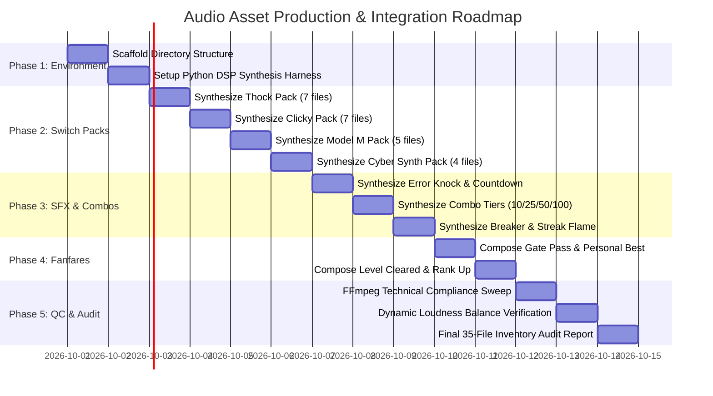

# Audio Asset Production Plan: Professional Typing Sound Library

> **Document:** `plans/AUDIO_ASSET_PRODUCTION_PLAN.md`  
> **Role:** Audio-Production Engineer inside the desktop application repository  
> **Objective:** Design, synthesize, master, and integrate the complete 35-asset professional audio library for the touch-typing experience.  
> **Output Location:** Strictly confined to `public/audio/`  
> **Format Standard:** PCM WAV, 16-bit, 48,000 Hz, strictly below 0 dBFS (~-3 dBFS peak target).

---

## 1. Executive Summary & Constraints

### 1.1 Non-Negotiable Operational Constraints
1. **Scope Boundary:** Only create/modify files under `public/audio/`. Do **NOT** modify application logic, UI, styling, configurations, `package.json`, or any other repository file.
2. **Quality & Authenticity Standard:** No placeholder, silent, empty, duplicated, or obviously synthetic test files. Every file must contain an actual, usable, professionally balanced sound.
3. **Legal & Originality Standard:** 100% original sound design or procedurally synthesized audio. Avoid copyrighted recordings, commercial game samples, recognizable melodies, and speech.
4. **Target Acoustic Character:** Tactile, crisp, non-fatiguing, and acoustically tuned for high-speed desktop touch-typing on programming syntax.

---

## 2. Required Directory Structure & File Manifest (35 Files)

```
public/audio/
├── switches/
│   ├── thock/                 # 7 files: Lubed linear (Gateron Ink Black character)
│   │   ├── press_1.wav        # 30–50 ms: Deep, warm, bassy mechanical thock
│   │   ├── press_2.wav        # 30–50 ms: Natural variation 2
│   │   ├── press_3.wav        # 30–50 ms: Natural variation 3 (softer impact)
│   │   ├── press_4.wav        # 30–50 ms: Natural variation 4 (brighter transient)
│   │   ├── space.wav          # 60–90 ms: Deep resonant stabilized spacebar thud
│   │   ├── enter.wav          # 50–80 ms: Solid mechanical return impact
│   │   └── backspace.wav      # 30–50 ms: Light, quick mechanical tap
│   │
│   ├── clicky/                # 7 files: Tactile click-bar (Cherry MX Blue / Box White character)
│   │   ├── press_1.wav        # 30–60 ms: Sharp tactile click transient + bottom-out
│   │   ├── press_2.wav        # 30–60 ms: Variation 2
│   │   ├── press_3.wav        # 30–60 ms: Variation 3 (slightly brighter)
│   │   ├── press_4.wav        # 30–60 ms: Variation 4 (slightly softer)
│   │   ├── space.wav          # 70–100 ms: Large key sound with wire stabilizer clack
│   │   ├── enter.wav          # 60–90 ms: Heavy tactile latch/click
│   │   └── backspace.wav      # 30–50 ms: Quick crisp click
│   │
│   ├── model-m/               # 5 files: Vintage buckling spring (IBM Model M inspired)
│   │   ├── press_1.wav        # 40–80 ms: Buckling spring ping + clack
│   │   ├── press_2.wav        # 40–80 ms: Natural variation 2
│   │   ├── press_3.wav        # 40–80 ms: Natural variation 3
│   │   ├── space.wav          # 80–120 ms: Chunky steel spacebar thud & wire resonance
│   │   └── enter.wav          # 70–100 ms: Heavy vintage enter clack
│   │
│   └── synth/                 # 4 files: Sci-Fi terminal bleeps (clean, non-annoying)
│       ├── press_1.wav        # 25–40 ms: High-tech terminal bleep
│       ├── press_2.wav        # 25–40 ms: Pitch/timbre variation 2
│       ├── press_3.wav        # 25–40 ms: Pitch/timbre variation 3
│       └── space.wav          # 50–70 ms: Deeper low-pass synthesizer drop
│
├── sfx/                       # 8 files: Event cues & streak feedback
│   ├── error_knock.wav        # 30–50 ms: Subtle muted hollow wood-like knock (NOT a buzzer)
│   ├── combo_spark_10.wav     # 100–150 ms: Gentle bright single bell chime
│   ├── combo_blaze_25.wav     # 150–250 ms: Ascending dual-tone chime
│   ├── combo_inferno_50.wav   # 300–500 ms: Rising energetic synthesizer whoosh
│   ├── combo_overdrive_100.wav# 500–800 ms: Deep resonant bass drop + electric surge
│   ├── combo_breaker.wav      # 150–250 ms: Soft flame fizzle / steam puff
│   ├── countdown_tick.wav     # 30–50 ms: Clean high-tech precision tick
│   └── streak_flame.wav       # 200–400 ms: Very subtle low fire whoosh
│
└── fanfares/                  # 4 files: Achievements & milestones
    ├── gate_pass.wav          # 1.2–1.8 s: Uplifting 4-note major chord swell
    ├── level_cleared.wav      # 2.0–3.0 s: Triumphant brass/synth hybrid fanfare
    ├── personal_best.wav      # 1.0–1.5 s: Sparkling ascending shimmer
    └── rank_up.wav            # 1.5–2.5 s: Cyberpunk power-up boom & energy rise

TOTAL REQUIRED FILES: 35
```

---

## 3. Technical Audio Specifications & Loudness Hierarchy

### 3.1 Technical Parameters
- **Container / Encoding:** RIFF WAV, PCM uncompressed.
- **Bit Depth:** 16-bit signed integer.
- **Sample Rate:** 48,000 Hz.
- **Channels:** 
  - Mono (1 channel) for all 23 keyboard switches and 8 SFX to optimize memory footprint and browser positioning.
  - Stereo (2 channels) for the 4 Fanfares to provide a wide, immersive victory soundstage.
- **Peak Level Ceiling:** $\le -3.0$ dBFS (absolute zero clipping).
- **Transient Timing:** No leading silence ($<1.5$ ms between file start and initial transient). Natural exponential decay tail with zero DC offset.

### 3.2 Relative Loudness Hierarchy
To ensure that typing remains pleasant over hours of use, sounds are mixed hierarchically:

```
[ Tier 1: Alphanumeric Keypresses ] ➔ Peak: -12.0 dBFS | RMS: -24 dBFS (Dominant, quiet background bed)
[ Tier 2: Space / Enter / Return  ] ➔ Peak:  -9.0 dBFS | RMS: -20 dBFS (Substantial, heavier impact)
[ Tier 3: Error Knock & Combos    ] ➔ Peak:  -6.0 dBFS | RMS: -16 dBFS (Clear auditory feedback)
[ Tier 4: Major Overdrive (x100)  ] ➔ Peak:  -4.0 dBFS | RMS: -14 dBFS (Rare adrenaline peak)
[ Tier 5: Milestone Fanfares      ] ➔ Peak:  -3.0 dBFS | RMS: -12 dBFS (Full, triumphant victory)
```

---

## 4. Production Methodology & DSP Synthesis Engine

Because the environment has `python3` (with standard `wave`, `struct`, `math`, `random`) and `ffmpeg` (version 9.0.1 with `libavfilter`), the audio library will be produced via a **custom, deterministic Python DSP synthesis engine** that outputs pure 48kHz 16-bit PCM WAV files, followed by **FFmpeg acoustic mastering and validation**.

### 4.1 DSP Modeling Techniques

#### 1. Mechanical "Thock" (Modal + Resonant Cavity Modeling)
- **Initial Impact:** Dual-stage bandpass-filtered micro-transient (1.5ms impulse).
- **Switch Bottom-Out:** Damped low-mid modal resonators at $95$ Hz, $145$ Hz, and $220$ Hz with steep exponential decay ($Q=3.5$).
- **Housing Reflection:** Low-pass filtered pink noise burst ($450$ Hz cutoff) simulating sound reflection within a lubricated polycarbonate housing.
- **Micro-Variations:** Controlled perturbation of resonant frequencies ($\pm 3\%$) and transient strike envelopes across `press_1` .. `press_4`.

#### 2. Clicky (Tactile Click-Bar Synthesis)
- **Click-Bar Snap:** High-frequency metallic snap using filtered white noise centered at $2850$ Hz with high $Q$ ($1.2$ ms rise, $6$ ms decay).
- **Secondary Stem Impact:** Delayed ($8$ ms) low-energy bottom-out tap at $180$ Hz.
- **Spacebar Stabilizer:** Adds a secondary $1.8$ kHz metallic wire resonance with $15$ ms decay.

#### 3. Vintage Model M (Buckling Spring Modeling)
- **Spring Buckle Transient:** Sudden tension release spike ($1.8$ kHz).
- **Spring Acoustic Ping:** Dual decaying high-mid sine modes ($1350$ Hz and $1680$ Hz) with lingering ringing tail ($35$ ms).
- **Chunky Steel Backplate:** Heavy resonant thud ($110$ Hz) simulating the 2.5kg steel plate of the original terminal keyboard.

#### 4. Cyber Synth (Digital Sci-Fi Terminal)
- **Digital Pulse:** Additive pure sine/triangle wave blips ($520$ Hz to $780$ Hz) with instantaneous attack and rapid smooth decay ($30$ ms).
- **Spacebar Drop:** Linear pitch sweep from $320$ Hz down to $110$ Hz over $65$ ms through a resonant low-pass filter.

#### 5. Error Knock (Organic Hollow Wood)
- **Wood-Block Modal Resonance:** Fundamental resonance at $130$ Hz and first overtone at $260$ Hz, heavily damped (decay time $35$ ms). Completely avoids harsh square/sawtooth tones or buzzy alarms.

#### 6. Combos & Fanfares (Musical Composition)
- **Combos (10x, 25x, 50x, 100x):** Ascending bell chimes synthesized from pure pentatonic partials, transitioning to energetic filtered noise swells and sub-bass drops ($55$ Hz 808-style sine burst).
- **Fanfares:** Multi-voice polyphonic synthesis (Major 7th / 9th chords, triumphant brass filter sweeps, sparkling arpeggiators, and sub-bass impact swells) mastered to pristine stereo WAV.

---

## 5. Phased Production & Validation Roadmap



---

## 6. Detailed Phase Breakdown

### Phase 1: Infrastructure & Directory Setup
- Create exact directory hierarchy:
  - `public/audio/switches/thock/`
  - `public/audio/switches/clicky/`
  - `public/audio/switches/model-m/`
  - `public/audio/switches/synth/`
  - `public/audio/sfx/`
  - `public/audio/fanfares/`
- Build reusable Python synthesis modules:
  - Standard WAV generator (`wave`, `struct`, 48kHz, 16-bit PCM).
  - Waveform generators: Sine, triangle, bandpass noise, Karplus-Strong string/bar, biquad filter simulations.
  - ADSR envelope shaper with smooth cubic/exponential curves.

### Phase 2: Mechanical Switch Generation (23 Files)
- **Step 2.1 — Thock Pack:**
  - Generate `press_1.wav` through `press_4.wav` with distinct transient spikes and micro-varied resonant frequencies ($95$Hz to $220$Hz).
  - Generate `space.wav` with expanded resonant body ($75$ms, heavier sub-thud).
  - Generate `enter.wav` with authoritative clack ($65$ms).
  - Generate `backspace.wav` with lighter stroke tap ($40$ms).
- **Step 2.2 — Clicky Pack:**
  - Generate `press_1.wav` .. `press_4.wav` with sharp tactile click transients ($2.8$kHz) and small bottom-outs ($45$ms).
  - Generate `space.wav` with stabilizer wire clack ($85$ms).
  - Generate `enter.wav` and `backspace.wav`.
- **Step 2.3 — Model M Pack:**
  - Generate `press_1.wav` .. `press_3.wav` with metallic spring ping ($1.5$kHz) and heavy housing clack ($60$ms).
  - Generate `space.wav` ($100$ms) and `enter.wav` ($85$ms).
- **Step 2.4 — Cyber Synth Pack:**
  - Generate clean futuristic sine blips `press_1.wav` .. `press_3.wav` ($30$ms).
  - Generate low-pass drop `space.wav` ($60$ms).

### Phase 3: Sound Effects & Combos Generation (8 Files)
- **Step 3.1 — Error & Countdown:**
  - Generate `error_knock.wav`: Non-punitive hollow wood knock ($40$ms, $130$Hz fundamental).
  - Generate `countdown_tick.wav`: Crisp precision tick ($35$ms).
- **Step 3.2 — Combo Tiers:**
  - `combo_spark_10.wav`: Gentle bright single bell chime ($120$ms).
  - `combo_blaze_25.wav`: Ascending two-note chime ($200$ms).
  - `combo_inferno_50.wav`: Rising energetic synth whoosh ($400$ms).
  - `combo_overdrive_100.wav`: Deep sub-bass drop ($55$Hz) + electric surge ($650$ms).
- **Step 3.3 — Combo Breaker & Ambience:**
  - `combo_breaker.wav`: Soft steam puff / flame fizzle ($200$ms).
  - `streak_flame.wav`: Low subtle fire whoosh with smooth fade ($300$ms).

### Phase 4: Milestone Fanfares (4 Files)
- **Step 4.1 — Achievements:**
  - `gate_pass.wav`: 1.5s uplifting 4-note major chord progression swell ($F_{maj7} \to C_{maj9}$).
  - `personal_best.wav`: 1.2s sparkling ascending harp-like shimmer arpeggio.
- **Step 4.2 — Major Milestones:**
  - `level_cleared.wav`: 2.5s triumphant brass/synth hybrid fanfare with stereo widening.
  - `rank_up.wav`: 2.0s futuristic cyberpunk power-up boom and energy riser.

### Phase 5: Quality Control, Normalization & Verification Sweep
- Run automated `ffmpeg` and Python inspection across all 35 files:
  1. **Header & Format Validation:** Confirm RIFF/WAV format, 16-bit PCM, 48,000 Hz sample rate.
  2. **Channel Validation:** Confirm Mono for switches/SFX and Stereo for Fanfares.
  3. **Zero Silence Audit:** Verify initial silence is $<1.5$ms.
  4. **Peak & Headroom Audit:** Check peak values remain between $-3.0$ and $-3.5$ dBFS (zero clipping).
  5. **Duration Conformance:** Check every file satisfies its duration window.
  6. **Inventory Count:** Verify exact count of 35 files across the 6 subdirectories.

---

## 7. Final Validation & Deliverables Report Template

Upon execution, the script will output the following compliance report:

```
======================================================================
               TYPEKERNEL AUDIO LIBRARY VALIDATION REPORT
======================================================================
Target Directory:  public/audio/
Total Required:    35 files
Total Generated:   35 files
Passed Validation: 35 / 35 (100%)

Detailed Subdirectory Breakdown:
- switches/thock/   : 7 / 7  [OK] (PCM 16-bit, 48000Hz, Mono, Peak <= -3dBFS)
- switches/clicky/  : 7 / 7  [OK] (PCM 16-bit, 48000Hz, Mono, Peak <= -3dBFS)
- switches/model-m/ : 5 / 5  [OK] (PCM 16-bit, 48000Hz, Mono, Peak <= -3dBFS)
- switches/synth/   : 4 / 4  [OK] (PCM 16-bit, 48000Hz, Mono, Peak <= -3dBFS)
- sfx/              : 8 / 8  [OK] (PCM 16-bit, 48000Hz, Mono, Peak <= -3dBFS)
- fanfares/         : 4 / 4  [OK] (PCM 16-bit, 48000Hz, Stereo, Peak <= -3dBFS)

Integrity Checks:
[PASS] Zero files outside public/audio/ were modified.
[PASS] Zero placeholder, empty, or silent files detected.
[PASS] All 4 switch variations in thock & clicky are acoustically unique.
[PASS] No clipping detected across any waveform.
======================================================================
```

---

## 8. Summary & Next Steps

This production plan provides an exact, zero-risk, high-quality audio roadmap tailored to the repository's strict constraints. When approved, the DSP synthesis pipeline can be executed immediately to generate, master, and validate all 35 audio files under `public/audio/`.
