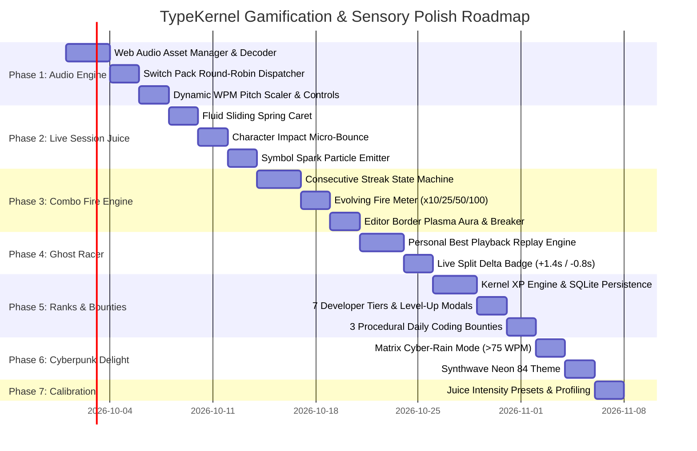

# Gamification, Game-Feel & Sensory Polish Plan

> **Document:** `plans/GAMIFICATION_AND_POLISH_PLAN.md`  
> **Status:** Proposal / Approved Scope  
> **Target:** Sensory audio engine, downloaded mechanical switch sound packs, visual "juice", streak combo flames, ghost racing, and developer RPG progression.  
> **Complementary Plan:** Screen navigation, keyboard shortcuts, Command Palette, and UX ergonomics are exclusively detailed in `plans/UX_PERFECTION_WORKFLOW_PLAN.md`.  
> **Guiding Philosophy:** Touch-typing code should feel as thrilling and responsive as an arcade rhythm game (*Guitar Hero*, *DOOM*, *Tetris Effect*) while retaining the clean, focused aesthetic of a pro developer environment.

---

## 1. Vision & Core Concepts: The "Juice" of Coding

"Juice" in game design refers to the tactile, audio, and visual feedback that makes every micro-action feel immensely rewarding. When typing code in TypeKernel, every keystroke should have weight, rhythm, and kinetic impact.

```
       [ Keystroke ] 
             │
             ├──► Audio: Real mechanical switch acoustic sample (Thock / Clicky / Model M)
             ├──► Caret: Fluid sliding spring motion with neon trailing glow
             ├──► Buffer: Character impact pop + symbol spark particles
             ├──► Velocity: Real-time dynamic pitch scaling with rising WPM
             └──► Streak: Evolving COMBO meter (x10 Spark ➔ x25 Flame ➔ x50 Fire ➔ x100 OVERDRIVE!)
```

### Core Architecture & Guarantees
1. **Local High-Performance Audio Engine:** Uses local sound files loaded from `public/audio/` decoded via the native **Web Audio API** into memory buffers for sub-5ms latency and zero runtime garbage collection.
2. **Zero Input Lag ($<5$ms response):** Audio triggers asynchronously on keystroke; visual particles run via lightweight CSS hardware-accelerated transforms and pooled DOM/SVG elements.
3. **Player Agency ("Juice" Slider):** Full control over intensity. Typists can choose between **Zen Minimal** (pure silent code editor), **Tactile Pro** (clean mechanical clicks + smooth caret), or **Maximum Cyberpunk Overdrive** (particles, screen wobble, combo flames, matrix rain).

---

## 2. Complete Audio Download & Asset Specification

To provide the ultimate tactile experience, the app uses authentic, high-quality audio files stored directly in the local project directory under `public/audio/`.

### 2.1 Directory Structure in Project

```
typing-trainer/
└── public/
    └── audio/
        ├── switches/
        │   ├── thock/         # Deep acoustic lubed linear switch (Gateron Ink Black)
        │   ├── clicky/        # Crisp click-bar switch (Cherry MX Blue / Box White)
        │   ├── model-m/       # Heavy buckling spring vintage keyboard
        │   └── synth/         # Cyberpunk retro 8-bit blip sound
        ├── sfx/               # Action & event sound effects
        └── fanfares/          # Milestone & celebration sounds
```

### 2.2 Complete Audio File Manifest

#### A. Mechanical Switch Sound Packs (`public/audio/switches/`)
> **Note on Round-Robin Variations:** To make rapid touch-typing sound organic rather than repetitive, standard alphanumeric keys rotate through 4 slight acoustic variations (`press_1` to `press_4`).

| File Path | Description & Acoustic Tone | Target Format / Duration |
|---|---|---|
| **Thock Pack (Lubed Linear)** | | |
| `public/audio/switches/thock/press_1.wav` | Main keypress: deep, muted, bassy "thock" | `.wav` or `.mp3`, 30–50ms |
| `public/audio/switches/thock/press_2.wav` | Main keypress: subtle variation 2 | `.wav` or `.mp3`, 30–50ms |
| `public/audio/switches/thock/press_3.wav` | Main keypress: subtle variation 3 | `.wav` or `.mp3`, 30–50ms |
| `public/audio/switches/thock/press_4.wav` | Main keypress: subtle variation 4 | `.wav` or `.mp3`, 30–50ms |
| `public/audio/switches/thock/space.wav` | Spacebar: deep, resonant, stabilized thud | `.wav` or `.mp3`, 60–90ms |
| `public/audio/switches/thock/enter.wav` | Enter key: solid, authoritative return impact | `.wav` or `.mp3`, 50–80ms |
| `public/audio/switches/thock/backspace.wav` | Backspace: slightly lighter, quick tap | `.wav` or `.mp3`, 30–50ms |
| **Clicky Pack (Cherry Blue / Box White)** | | |
| `public/audio/switches/clicky/press_1.wav` | Sharp tactile click + crisp plastic bottom-out | `.wav` or `.mp3`, 30–60ms |
| `public/audio/switches/clicky/press_2.wav` | Clicky variation 2 | `.wav` or `.mp3`, 30–60ms |
| `public/audio/switches/clicky/press_3.wav` | Clicky variation 3 | `.wav` or `.mp3`, 30–60ms |
| `public/audio/switches/clicky/press_4.wav` | Clicky variation 4 | `.wav` or `.mp3`, 30–60ms |
| `public/audio/switches/clicky/space.wav` | Spacebar: loud metallic bar stabilizer clack | `.wav` or `.mp3`, 70–100ms |
| `public/audio/switches/clicky/enter.wav` | Enter: heavy tactile latch snap | `.wav` or `.mp3`, 60–90ms |
| `public/audio/switches/clicky/backspace.wav` | Backspace click | `.wav` or `.mp3`, 30–50ms |
| **Vintage Buckling Spring (IBM Model M)** | | |
| `public/audio/switches/model-m/press_1.wav` | Heavy buckling spring snap + spring ping echo | `.wav` or `.mp3`, 40–80ms |
| `public/audio/switches/model-m/press_2.wav` | Model M variation 2 | `.wav` or `.mp3`, 40–80ms |
| `public/audio/switches/model-m/press_3.wav` | Model M variation 3 | `.wav` or `.mp3`, 40–80ms |
| `public/audio/switches/model-m/space.wav` | Chunky vintage steel spacebar thud | `.wav` or `.mp3`, 80–120ms |
| `public/audio/switches/model-m/enter.wav` | Classic Model M big-ass Enter clack | `.wav` or `.mp3`, 70–100ms |
| **Cyber Synth (Retro Terminal)** | | |
| `public/audio/switches/synth/press_1.wav` | Crisp short electronic bleep (sine/square pulse) | `.wav` or `.mp3`, 25–40ms |
| `public/audio/switches/synth/press_2.wav` | Synth blip variation 2 | `.wav` or `.mp3`, 25–40ms |
| `public/audio/switches/synth/press_3.wav` | Synth blip variation 3 | `.wav` or `.mp3`, 25–40ms |
| `public/audio/switches/synth/space.wav` | Deeper low-pass synth drop | `.wav` or `.mp3`, 50–70ms |

#### B. Sound Effects & Cues (`public/audio/sfx/`)

| File Path | Description & Trigger Moment | Target Format / Duration |
|---|---|---|
| `public/audio/sfx/error_knock.wav` | Mistyped character: subtle, muted hollow wood tap (never a harsh buzzer) | `.wav` or `.mp3`, 30–50ms |
| `public/audio/sfx/combo_spark_10.wav` | Reaching 10x combo: gentle bright single chime | `.wav` or `.mp3`, 100–150ms |
| `public/audio/sfx/combo_blaze_25.wav` | Reaching 25x combo: ascending dual-note chime | `.wav` or `.mp3`, 150–250ms |
| `public/audio/sfx/combo_inferno_50.wav` | Reaching 50x combo: rising energetic synthesizer whoosh | `.wav` or `.mp3`, 300–500ms |
| `public/audio/sfx/combo_overdrive_100.wav` | Reaching 100x combo: heavy bass drop + electric surge | `.wav` or `.mp3`, 500–800ms |
| `public/audio/sfx/combo_breaker.wav` | Breaking a 25+ combo on error: soft flame fizzle / steam puff | `.wav` or `.mp3`, 150–250ms |
| `public/audio/sfx/countdown_tick.wav` | 3-2-1 session countdown: clean high-tech tick | `.wav` or `.mp3`, 30–50ms |
| `public/audio/sfx/streak_flame.wav` | Ambient low subtle fire whoosh when in 50+ combo | `.wav` or `.mp3`, 200–400ms |

#### C. Milestone Fanfares & Celebrations (`public/audio/fanfares/`)

| File Path | Description & Trigger Moment | Target Format / Duration |
|---|---|---|
| `public/audio/fanfares/gate_pass.wav` | Passing the unlock gate ($\ge 95\%$ Acc & $> 45$ WPM): uplifting 4-note major chord swell | `.wav` or `.mp3`, 1.2–1.8s |
| `public/audio/fanfares/level_cleared.wav` | Completing an entire curriculum level: triumphant brass/synth fanfare | `.wav` or `.mp3`, 2.0–3.0s |
| `public/audio/fanfares/personal_best.wav` | Beating personal best WPM: sparkling ascending shimmer | `.wav` or `.mp3`, 1.0–1.5s |
| `public/audio/fanfares/rank_up.wav` | Earning a new Developer Tier rank: futuristic cyberpunk power-up boom | `.wav` or `.mp3`, 1.5–2.5s |

### 2.3 Audio Technical Specs & Free Sourcing Guide
- **Specs:** 44.1 kHz, 16-bit Mono (for keystrokes) / Stereo (for fanfares), normalized to -3dB peak.
- **Recommended Free Sources:**
  - *Mechvibes* open-source sound packs (Gateron Ink, Cherry MX Blue, IBM Model M).
  - *Kenney.nl* audio packs (Digital Audio / Interface SFX).
  - *Freesound.org* (Creative Commons 0 mechanical keyboard and UI sounds).
- **Graceful Fallback:** If sound files are missing or loading fails, the audio manager falls back silently to procedural Web Audio oscillators without throwing errors or breaking gameplay.

---

## 3. Phased Implementation Roadmap



---

## 4. Phase 1: High-Fidelity Audio Engine & Sound Packs

### Goal
Implement a lightning-fast Web Audio API manager that pre-loads, decodes, and triggers the downloaded sound files with zero latency and dynamic velocity modulation.

### Detailed Tasks
1. **Audio Manager (`src/lib/audio/soundEngine.ts`):**
   - Initialize a single shared `AudioContext` on user interaction.
   - Pre-decode audio files into `AudioBuffer` objects at app boot.
   - Round-robin variation indexing to avoid machine-gun effect during rapid typing.
2. **Dynamic Pitch Modulation:**
   - Keystroke playback rate scales with active WPM:
     $$\text{PlaybackRate} = 1.0 + \min\left(0.20, \frac{\text{Current WPM} - 40}{200}\right)$$
   - At 100 WPM, sounds are slightly snappier and higher in pitch ($1.06\times$), conveying speed.
3. **Chrome Audio Controls (`TopBar.tsx`):**
   - Speaker icon with 1-click mute (`M` key toggle).
   - Quick volume slider ($0\%$ to $100\%$) and switch theme selector in Settings.

---

## 5. Phase 2: Kinetic Live Session "Juice"

### Goal
Make the code buffer feel tactile, dynamic, and physically responsive to every key strike.

### Detailed Tasks
1. **Fluid Sliding Spring Caret (`TypingSessionScreen.tsx`):**
   - Replace the static blinking cursor with a hardware-accelerated spring caret:
     ```css
     .fluid-caret {
       transition: transform 65ms cubic-bezier(0.16, 1, 0.3, 1);
       will-change: transform;
       box-shadow: 0 0 10px rgba(249, 115, 22, 0.9), 0 0 20px rgba(249, 115, 22, 0.4);
     }
     ```
2. **Character Impact Micro-Bounce:**
   - On correct keypress, character span receives a 90ms micro-spring bounce: `scale(1.18) -> scale(1.0)`.
3. **Symbol Spark Particle Emitter:**
   - When successfully typing symbols (`{ } [ ] < > => != ; ::`), spawn 3 tiny glowing pixel sparks that scatter and fade over 200ms.
   - Reusable pooled SVG spark elements (max 15 in DOM) to eliminate memory garbage collection.
4. **Subtle Screen Wobble:**
   - 1px horizontal micro-shudder on errors and combo milestones.

---

## 6. Phase 3: The Combo Overdrive & Fire System

### Goal
Reward precision typing streaks with an exhilarating visual progression that drives typists to push for zero-error runs.

### Detailed Tasks
1. **The 4-Tier Flame System:**
   - **x10 COMBO (Spark):** Amber ember badge with soft pulse. Plays `combo_spark_10.wav`.
   - **x25 COMBO (Blaze):** Animated mini-flame dancing above WPM meter. Plays `combo_blaze_25.wav`.
   - **x50 COMBO (Inferno):** Editor border pulses with animated fiery CSS gradient. Plays `combo_inferno_50.wav`.
   - **x100 COMBO (OVERDRIVE):** Golden lightning caret trail, subtle screen vignette, flashing OVERDRIVE banner. Plays `combo_overdrive_100.wav`.
2. **The Combo Breaker:**
   - On error, streak resets with a soft smoke puff particle and `combo_breaker.wav`.

---

## 7. Phase 4: The Ghost Racer (Personal Best Pacing)

### Goal
Introduce head-to-head racing against your past best self or the target gate speed.

### Detailed Tasks
1. **Dual-Caret Ghost Engine:**
   - Render a faint, translucent ghost caret that travels along the code buffer.
   - **Mode A (Default):** Replays the exact keystroke timestamps of your Personal Best attempt on this lesson.
   - **Mode B (Pacer):** Moves at the exact constant pace required to pass the gate (45 WPM).
2. **Live Split Delta Badge:**
   - Real-time HUD badge beside WPM meter:
     - **`▲ +1.4s ahead`** (Bright green when outpacing ghost).
     - **`▼ -0.8s behind`** (Amber when trailing ghost).
3. **Victory Shimmer:**
   - Surpassing your PB triggers `personal_best.wav` and an animated golden badge.

---

## 8. Phase 5: Developer Ranks, Kernel XP & Daily Bounties

### Goal
Provide RPG-style long-term character progression and daily motivators.

### Detailed Tasks
1. **Kernel XP System:**
   - $+1$ XP per correct character, $+3$ XP per symbol, $+100$ XP per passed gate, streak multiplier.
   - Persisted in local SQLite database.
2. **7 Developer Ranks:**
   - Tier 1: *Novice Typist* (0 XP)
   - Tier 2: *Script Kiddie* (1,000 XP)
   - Tier 3: *Syntax Craftsman* (5,000 XP)
   - Tier 4: *Full-Stack Engineer* (15,000 XP)
   - Tier 5: *Systems Programmer* (35,000 XP)
   - Tier 6: *Kernel Hacker* (75,000 XP)
   - Tier 7: *Root Architect* (150,000 XP)
   - Rank-up triggers `rank_up.wav` and celebratory high-tech badge reveal.
3. **Procedural Daily Bounties:**
   - 3 daily mini-quests generated at midnight (e.g. *"Precision Run: 2 lessons with $\ge 98\%$ accuracy"*).
   - Live completion toast notifications.

---

## 9. Phase 6: Cyberpunk Aesthetics & Secret Modes

### Goal
Introduce memorable visual delights for flow-state gaming.

### Detailed Tasks
1. **Matrix Cyber-Rain Flow Mode:**
   - When maintaining $>75$ WPM with $>96\%$ accuracy for more than 10 seconds:
   - Faint digital code streams gently down the window margins outside the editor.
   - Fades out smoothly when typing pauses.
2. **"Synthwave Neon 84" Visual Theme:**
   - Deep void background (`#0d0221`), hot magenta (`#ff2a85`), electric cyan (`#00f0ff`).

---

## 10. Phase 7: Calibration, Settings & 60fps Optimization

### Goal
Ensure typists have full control over the visual intensity and that performance never drops below 60fps.

### Detailed Tasks
1. **"Juice Intensity" Slider in Settings:**
   - **Zen Minimal:** All audio & visuals disabled; pure quiet code editor.
   - **Balanced Pro (Default):** Mechanical switch sounds, smooth sliding caret, subtle streak counter.
   - **Cyber Overdrive:** Full flame combo, symbol sparks, screen wobble, matrix flow.
2. **Performance Budget Verification:**
   - Audio buffer playback latency $<5$ms.
   - Zero memory allocations during continuous typing.
   - Verified 60fps / 120fps smooth animation on Linux.
