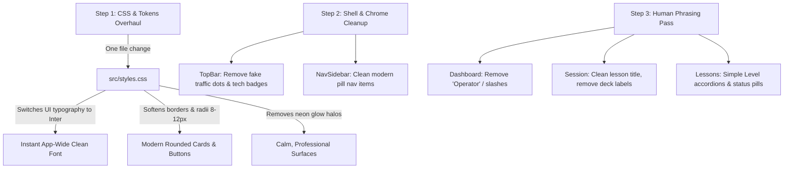

# UI Simplification Plan: Modern Minimalist Dark Theme

> **Document:** `plans/SIMPLIFY_DESIGN_SYSTEM_PLAN.md`  
> **Target:** Transform TypeKernel from a complex "terminal / cyberpunk operator" aesthetic into a **simple, clean, modern dark UI** (inspired by Linear, Raycast, and VS Code).  
> **Core Constraints:**  
> 1. **Do NOT rebuild the UI from scratch:** Use high-leverage CSS token remaps and targeted component touch-ups.  
> 2. **Keep the Dark Theme:** Deep dark surfaces (`#0f131c` / `#0a0e17`) stay.  
> 3. **Keep the Orange Primary Accent:** The warm orange accent (`#f97316`) stays as the brand identity.  
> 4. **Eliminate the Terminal Gimmicks:** Remove military uppercase monospaced chrome, `//` double slashes, "Operator" persona jargon, neon glow borders, and fake window traffic lights.

---

## 1. Executive Summary & Aesthetic Comparison

The current design uses a heavy **"Solaris Forge / Terminal Mission Control"** aesthetic. While unique, it introduces visual noise: monospace typography on UI labels, all-caps buttons, sci-fi military copy ("OPERATOR ONLINE // SESSION 12"), harsh 2px corners, and intense neon glow borders.

This plan modernizes the UI with a **Simple, Modern Dark System**:
- **Typography:** Clean sans-serif (**Inter**) for all UI labels, buttons, navigation, and titles. Monospace (**JetBrains Mono**) is preserved *strictly* for the code buffer and telemetry numbers.
- **Tone & Copy:** Friendly, clear, human developer copy ("Welcome back", "Level 1: Fundamentals", "In progress") instead of sci-fi terminal jargon ("OPERATOR ONLINE // NEUROMUSCULAR BUFFER WARM").
- **Surfaces & Borders:** Clean, subtle 1px dividers (`border-white/5` or `border-surface-container-highest/20`), soft modern corner radii (8px–12px), and flat matte cards without aggressive neon glow lines.
- **Badges & Tabs:** Soft rounded pill badges (`rounded-full px-2.5 py-0.5 text-xs font-medium`) instead of boxy, all-caps terminal tags.

```
CURRENT (Terminal / Sci-Fi)                PROPOSED (Modern Minimalist)
─────────────────────────────────────────────────────────────────────────────
[OPERATOR ONLINE // SESSION 12]            Welcome back
Welcome back, Operator.                    Pick up where you left off.
ACTIVE MODULE // 01.01                     Lesson 1.01: Home Row Basics
TRACK 01 // LEVEL 01                       Level 1 • Fundamentals
[ RUNNING ] [ MASTERED ]                   ● In progress  ✓ Mastered
60% MECH PROGRAMMER DECK                   Virtual Keyboard Guide
Harsh 2px corners, neon glow borders       Clean 8-12px rounded corners, flat matte
Monospace everywhere                       Inter for UI, JetBrains Mono for Code
```

---

## 2. High-Leverage Transformation Strategy

Instead of rewriting components, we achieve 80% of the transformation in **Step 1** via CSS tokens and shared primitives:



---

## 3. Phased Implementation Roadmap

| Phase | Title | High-Leverage Scope | Estimated Effort |
|---|---|---|---|
| **Phase 1** | **Global Token & Typography Remap** | Overhaul `src/styles.css` (radii, typography mapping, border softness, glow removal). | 1 day |
| **Phase 2** | **TopBar & Sidebar Chrome Cleanup** | Remove fake traffic dots, clean breadcrumbs, modern minimal streak indicator. | 1 day |
| **Phase 3** | **Human Phrasing & Copywriting Pass** | Eliminate "Operator", `//` slashes, and military jargon across all screens. | 1 day |
| **Phase 4** | **Card Surfaces & Status Pill Redesign** | Remove neon sidebars; style soft rounded badges and clean dividers. | 1.5 days |
| **Phase 5** | **Typing Arena Simplification** | Clean editor header, simplify keyboard visual deck, calm telemetry metrics. | 1.5 days |
| **Phase 6** | **Results & Curriculum Screen Polish** | Clean results scorecard, modern curriculum list, simple settings forms. | 1 day |

---

## 4. Phase 1: Global Token & Typography Overhaul (`src/styles.css`)

### Goal
Transform the visual weight of the entire app with a single file edit, giving every screen modern proportions without touching component markup.

### Tasks
1. **Modernize Corner Radii:**
   - Change the boxy, sharp terminal radii:
     ```css
     /* Before: Industrial boxy radii */
     --radius: 0.125rem;       /* 2px */
     --radius-lg: 0.25rem;    /* 4px */
     --radius-xl: 0.5rem;     /* 8px */
     --radius-full: 0.75rem;  /* 12px (Not a pill!) */

     /* After: Modern clean software radii */
     --radius-sm: 0.375rem;   /* 6px */
     --radius: 0.5rem;        /* 8px */
     --radius-lg: 0.75rem;    /* 12px */
     --radius-xl: 1rem;       /* 16px */
     --radius-full: 9999px;   /* True pill badges */
     ```
2. **Remap UI Typography to Inter:**
   - In `--font-code-sm` and `--font-label-sm` when used across buttons and labels, ensure UI elements inherit `Inter` by default.
   - Retain `JetBrains Mono` strictly for `.font-mono`, `code`, and the typing buffer.
   - Remove aggressive negative letter-spacing and forced uppercase styling.
3. **Soften Surface Contrast & Borders:**
   - Replace harsh high-contrast border outlines (`#584237` / `#31353f`) with soft, translucent borders:
     `--color-surface-container-highest: rgba(255, 255, 255, 0.08)`.
   - Cards feel lightweight, subtle, and layered rather than caged in thick frames.
4. **Eliminate Neon Glow Halos:**
   - Disable `--accent-alpha` box-shadows (`box-shadow: 0 0 12px rgba(249, 115, 22, ...)`).
   - Replace with modern subtle dropshadows (`shadow-sm`, `shadow-md`, `shadow-black/20`).

---

## 5. Phase 2: Shell & Chrome Cleanup (`TopBar.tsx`, `NavSidebar.tsx`)

### Goal
Make the outer frame feel like a native, premium desktop productivity tool (like Raycast or VS Code).

### Tasks
1. **TopBar Simplification (`src/components/TopBar.tsx`):**
   - **Remove fake traffic lights:** The 3 decorative red/yellow/green dots add visual confusion on Linux/Wayland where native window decorations already exist. Remove them.
   - **Remove technical jargon badge:** Remove `TAURI v2.1.0-OFFLINE` and replace with a clean logo badge: `TypeKernel` in semi-bold Inter with a subtle orange dot.
   - **Clean Breadcrumb:** Instead of uppercase monospaced `DASHBOARD`, display clean sentence case: `Dashboard` or `Level 1 / Lesson 4`.
   - **Refined Streak & WPM:** Simple flame icon with `3-day streak` in muted text, and `48 WPM avg`.
2. **NavSidebar Modernization (`src/components/NavSidebar.tsx`):**
   - Replace harsh vertical orange left-border bars with clean, rounded pill hover/active states (`bg-white/5 text-primary rounded-lg`).
   - Use clean title case labels: `Dashboard`, `Lessons`, `Weakness`, `Custom`, `Statistics`, `Settings` (instead of all-caps or underscore names).
   - Icons: Clean Lucide/Material icons with subtle opacity transitions.

---

## 6. Phase 3: Human Phrasing & Copywriting Cleanup

### Goal
Eliminate the dated "cyberpunk hacker operator" persona and replace it with natural, encouraging developer language.

### Exact String Replacements

| File | Current Terminal Copy | Modern Simple Replacement |
|---|---|---|
| **Dashboard** | `OPERATOR ONLINE // SESSION 14` | *Removed* or replaced with `Welcome back` |
| **Dashboard** | `LOCAL TRAINING PIPELINE` | *Removed* |
| **Dashboard** | `Welcome back, Operator.` | `Welcome back` |
| **Dashboard** | `Your neuromuscular buffer is warm. Resume the active module...` | `Pick up where you left off or practice your weak keys.` |
| **Dashboard** | `ACTIVE MODULE // 01.01` | `Current Lesson: 1.01 — Home Row` |
| **Dashboard** | `Operator Status Offline` | `Database Offline` |
| **Session** | `TRACK 01 // LEVEL 01` | `Level 1: Fundamentals` |
| **Session** | `LEVEL 01 // IDLE` | `Level 1 • Fundamentals` |
| **Session** | `module.txt` / `data_object` | Lesson title (e.g. `Home Row Basics`) |
| **Session** | `60% MECH PROGRAMMER DECK` | `Keyboard Guide` |
| **Session** | `Active Sequence Keys: [a] then [b]` | `Next key: [a]` |
| **Results** | `SESSION COMPLETE` | `Lesson Complete` |
| **Results** | `NOT SAVED` / `SAVED` | `Saved to history` |
| **Lessons** | `MODULE 01.01 // ACTIVE` | `Lesson 1.01 • In Progress` |

---

## 7. Phase 4: Card Surfaces, Dividers & Status Pills

### Goal
Give cards, tables, and status pills a clean, calm, modern appearance.

### Tasks
1. **Remove Neon Sidebars on Cards:**
   - In `DashboardScreen.tsx` and `TypingSessionScreen.tsx`, remove the absolute positioned vertical lines:
     `div className="absolute bottom-0 left-0 top-0 w-1.5 bg-primary-container shadow-[0_0_12px...]"`
   - Cards look significantly cleaner and less cluttered as solid, softly bounded containers.
2. **Modernize Status Chips:**
   - Replace harsh rectangular tags (`[ RUNNING ]`, `[ MASTERED ]`, `[ LOCKED ]`) with smooth pill badges:
     - **Mastered:** `bg-emerald-500/10 text-emerald-400 border border-emerald-500/20 rounded-full px-2.5 py-0.5 text-xs font-medium`
     - **In Progress:** `bg-orange-500/10 text-orange-400 border border-orange-500/20 rounded-full px-2.5 py-0.5 text-xs font-medium`
     - **Available:** `bg-surface-container-high text-on-surface-variant rounded-full px-2.5 py-0.5 text-xs font-medium`
     - **Locked:** `bg-surface-container-lowest text-outline/60 rounded-full px-2.5 py-0.5 text-xs`
3. **Clean Flat Metric Cards (`StatCard.tsx`):**
   - Simple flat container (`bg-surface-container-low/60 rounded-xl p-4 border border-white/5`).
   - Clean number typography, subtle muted labels.

---

## 8. Phase 5: Typing Arena Simplification (`TypingSessionScreen.tsx`)

### Goal
Keep typing distraction-free, focused, and elegant.

### Tasks
1. **Clean Code Buffer Header:**
   - Remove pseudo-editor clutter (`UTF-8`, `Ln 1, Col 1`, `module.txt`).
   - Simple, elegant header: `Lesson 1.04 — Shift & Brackets` with a subtle WPM target indicator.
2. **Simplified Keyboard Visualization (`KeyboardVisualization.tsx`):**
   - Remove the technical header text (`60% MECH PROGRAMMER DECK`).
   - Render clean, rounded keycaps with subtle borders (`rounded-md bg-surface-container-high text-on-surface`).
   - Active key glows softly with the primary orange accent, without blinding neon flares.
3. **Calm Telemetry Strip:**
   - Display WPM, Accuracy, and Progress in a clean, horizontal metrics bar with subtle dividers.

---

## 9. Phase 6: Results, Curriculum & Settings Polish

### Tasks
1. **Lesson Results Screen (`LessonResultsScreen.tsx`):**
   - Replace the heavy military scorecard with a clean modern achievement view:
     - Clear verdict banner: `Passed!` or `Keep practicing`.
     - 4 clean metric boxes: Speed, Accuracy, Time, Errors.
     - Missed keys displayed as clean, rounded chips.
     - Clear, large primary button: `Continue (Enter)` or `Retry (Enter)`.
2. **Curriculum Screen (`LessonsScreen.tsx`):**
   - Clean level accordions with simple disclosure chevrons.
   - Clean grid of module cards with clean progress indicators.
3. **Settings Screen (`SettingsScreen.tsx`):**
   - Standard macOS/iOS-style clean preference panels:
     - Grouped rows with clean toggles and dropdown selectors.
     - Clean typography and muted descriptions.

---

## 10. Summary Checklist: What Changes vs. What Stays

### What STAYS (Unchanged)
- [x] **Dark Theme:** Deep dark backgrounds (`#0f131c`, `#0a0e17`) and dark container layers.
- [x] **Primary Orange:** `#f97316` remains the primary accent color across buttons, highlights, and active states.
- [x] **Core Layout & Components:** No screens are deleted or rewritten; grid layouts and store logic remain 100% intact.
- [x] **Code Typography:** JetBrains Mono remains the font for code text and numeric statistics.

### What CHANGES (Simplified)
- [x] **Typography:** All UI chrome, titles, buttons, and navigation switch to clean sans-serif **Inter**.
- [x] **Copy:** All "Operator", `//` slashes, and military tech jargon are replaced with friendly, modern English.
- [x] **Shapes:** Boxy 2px corners become soft 8px–12px rounded corners; pills become true rounded-full shapes.
- [x] **Decorations:** Neon glow sidebars, fake window traffic lights, and heavy borders are replaced with clean, flat, modern borders (`border-white/5`).
- [x] **Badges:** All-caps rectangular tags become soft, rounded modern status pills.

---

This plan gives you a fast, direct path to a sleek, modern, professional UI without breaking code or starting from scratch. When ready, we can begin with **Phase 1: Global Token & Typography Overhaul**.
