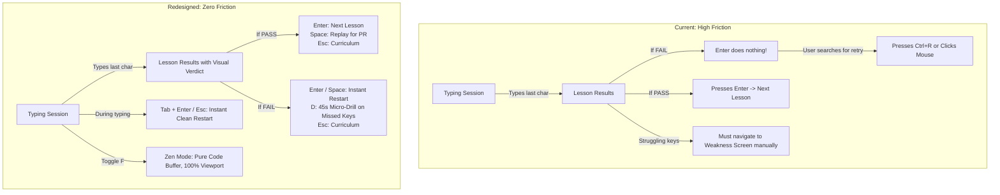
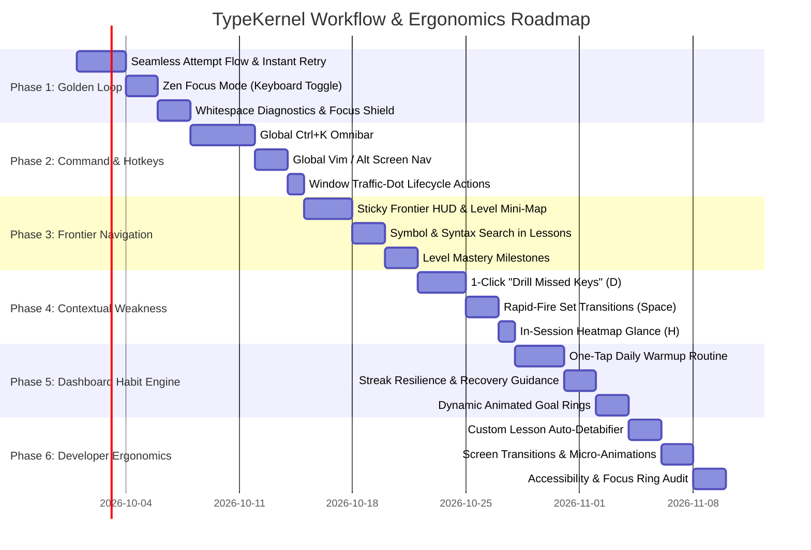

# UX & Workflow Redesign Plan: Flow-State & Ergonomic Perfection

> **Document:** `plans/UX_PERFECTION_WORKFLOW_PLAN.md`  
> **Status:** Proposal / Approved Scope  
> **Scope:** Full-app workflow redesign, keyboard-first navigation, friction elimination, screen loops, and developer ergonomics.  
> **Complementary Plan:** Sensory audio, sound packs, visual particles, combo fire, and game-feel are exclusively detailed in `plans/GAMIFICATION_AND_POLISH_PLAN.md`.  
> **Guiding Principle:** Every action in the app must be executable without touching the mouse; every transition must preserve flow-state; zero dead keys and zero hesitation.

---

## 1. Executive Summary & Design Vision

TypeKernel is functionally robust: it possesses an accurate event-sourced typing engine, 260 curated lessons, local SQLite persistence, adaptive intelligence, and an authentic dark terminal aesthetic. 

However, a technical audit of user workflows reveals several **cognitive and ergonomic friction points** that disrupt the typist's flow state:
1. **The Post-Attempt Dead End:** Failing an attempt currently dead-ends `Enter`. Typists must reach for the mouse or know to press `Ctrl+R`.
2. **Buffer Cramping & Visual Clutter:** On standard laptop displays, the virtual keyboard consumes ~40% of vertical height, squishing multi-line code buffers down to 4 visible lines with no distraction-free Zen mode.
3. **Mouse Dependence for Navigation:** Navigating between the 8 screens requires clicking the sidebar or top bar. The documented `Ctrl+K` command palette is missing.
4. **Context Switching to Weakness Training:** Practicing struggling keys requires abandoning the lesson flow, navigating to a separate screen, configuring a drill, and starting anew.
5. **Navigation Fatigue in 260 Lessons:** Navigating the curriculum requires extensive scrolling with no instant "Jump to Frontier" sticky action or level mini-map.
6. **Focus Dropping:** Accidental mouse clicks outside the editor can steal keyboard focus, causing keystrokes to drop.

### The "Perfectionist" Workflow Goals
Transform TypeKernel into the **ultimate developer typing sanctum**:
- **0ms Flow Interruption:** Move from Dashboard $\to$ Lesson $\to$ Results $\to$ Next Lesson or Instant Retry with pure single-key gestures (`Enter`, `Tab`, `Space`, `Esc`).
- **Pro Developer Tooling:** Global `Ctrl+K` Command Palette, Vim-style quick jumps (`g d`, `g l`, `g w`), Zen Mode (`F`), and instant 1-click micro-drills (`D`).
- **Unbreakable Focus:** Clicks outside the buffer never drop keyboard capture.
- **Instant Curriculum Access:** Sticky frontier HUD and syntax filter chips.

---

## 2. Comprehensive Screen & Workflow Audit

### 2.1 The Golden Loop Audit (Session $\leftrightarrow$ Results)

### 2.2 Screen-by-Screen Friction & Opportunity Matrix

| Screen | Current Friction Points | Redesign Solution |
|---|---|---|
| **Global Shell** | • No Command Palette (`Ctrl+K`). • Mouse required to switch screens. • Header traffic dots are purely decorative dead elements. | • Global `Ctrl+K` omnibar with instant search, screen jumps, and actions. • Omnipresent keyboard shortcuts (`Alt+1..6`, `g d`, `g l`, etc.). • Traffic dots wired to native window minimize, maximize, and app quit. |
| **Typing Session** | • Virtual keyboard squishes code buffer on laptops. • Spaces & newlines can be ambiguous in multi-line code. • Accidental mouse clicks steal keystroke focus. • Tab key inserts space instead of standard restart/navigation convention. | • **Zen / Focus Mode (`F` or `Ctrl+Shift+F`)**: hides sidebar & keyboard, expands editor to full screen. • **Subtle Syntax Glyphs**: optional faint `⏎` for newlines and `·` for spaces. • **Auto-Refocus Guard**: clicks outside buffer never drop key listener. • `Tab + Enter` or `Ctrl+R` for immediate buffer reset. |
| **Lesson Results** | • Dead `Enter` key on failure. • Failure feels punitive rather than diagnostic. • No 1-click drill for the specific keys failed. | • **Unified Primary Action**: `Enter` always does the smartest next step (`Next Lesson` on PASS, `Retry Lesson` on FAIL). • **Missed Keys Micro-Drill (`D`)**: 1-click button to run a focused 45-second drill on the exact characters failed. • `Space` replays current lesson to beat personal record. |
| **Lessons Screen** | • 260 lessons create a wall of cards. • Finding the active frontier requires scrolling or filter clicks. • No syntax filter (e.g. find all "SQL" or "Arrow Function" lessons). | • **Sticky "Resume Frontier" Action Bar**: floating pill with instant `Enter` to jump right to current lesson. • **Level Mini-Map**: vertical track selector on the left/right. • **Instant Syntax & Symbol Search**: filter by actual characters like `=>` or `{}`. |
| **Weakness Training** | • Sequestered from the main curriculum. • Set transitions require clicking with mouse. • Projections chart is static and detached. | • **Contextual Drill Launcher**: access targeted drills from anywhere in the app. • **Rapid-Fire Sets**: `Space` advances to next set immediately. • **Target Elimination Counter**: visual health-bar for struggling keys (`{` 82% $\to$ 94% Eliminated!). |
| **Dashboard** | • Enter key resume only works if window focus is untouched. • Daily goals panel is passive. • No guided "Today's Warmup Routine". | • **Guaranteed Enter Resume**: global hotkey captures `Enter` when on Dashboard regardless of focus. • **Guided Warmup Recommendation**: "Daily Habit: 1 Warmup Drill $\to$ 2 Curriculum Lessons". • **Streak Freeze / Resilience Hints**: positive reinforcement for consistency. |
| **Custom Lessons** | • Form modal is heavy. • Pasting code with tabs requires manual cleanup. | • **Auto-Detabifier**: automatically converts pasted tabs to 2 or 4 spaces with a badge indicator. • **1-Click Quick Practice**: test-run draft directly from editor. |
| **Settings** | • Tabbed list requires mouse clicking. • Zen preferences missing. | • Full keyboard navigation through settings tabs (`ArrowUp`/`ArrowDown`). • Default Zen Mode toggle. |

---

## 3. Phased Implementation Roadmap

---

## 4. Phase 1: Frictionless Golden Loop (Session $\leftrightarrow$ Results)

### Goal
Eliminate every hesitation, mouse dependency, and jarring transition between starting a lesson, typing, viewing results, and advancing.

### Detailed Tasks

#### 1.1 The "Smart Enter" & Instant Retry Convention (`LessonResultsScreen.tsx`)
- **Current problem:** If the attempt failed, pressing `Enter` does nothing. Typists feel trapped.
- **Redesign:**
  - If **PASS**:
    - `Enter` $\to$ Start Next Lesson (`nextLesson()`).
    - `Space` $\to$ Replay Current Lesson to beat Personal Best.
    - `Esc` $\to$ Return to Lessons Curriculum.
  - If **FAIL**:
    - `Enter` or `Space` $\to$ **Instant Retry** (`retryLesson()`). The primary action key never dead-ends.
    - `D` $\to$ Launch a 45-second **Micro-Drill** targeting the worst keys identified in `keyReport`.
    - `Esc` $\to$ Return to Lessons Curriculum.
  - Visual display: Clear, glowing primary action button with shortcut badge (`[Enter] Continue` or `[Enter] Retry`).

#### 1.2 In-Session Instant Reset & Pause (`TypingSessionScreen.tsx`)
- **Keybinding:** Support standard competitive typing reset combos:
  - `Tab + Enter` or `Ctrl+R` $\to$ Instant buffer reset without confirmation dialogs.
  - `Esc` $\to$ Abandon session with clean exit to curriculum.
- **Focus Shield:** Add an invisible overlay or automatic event listener so clicking anywhere inside the window never drops the keyboard listener. Typists should never have to "click into the box to start typing".

#### 1.3 Zen / Focus Mode (`TypingSessionScreen.tsx`)
- **Toggle:** Press `F` or `Ctrl+Shift+F` (or click a compact header toggle) to enter **Zen Mode**.
- **Behavior in Zen Mode:**
  - Smoothly collapse the left `ModuleSidebar`.
  - Smoothly collapse the bottom `KeyboardVisualization`.
  - Center and expand the `CodeBuffer` to fill 100% of available viewport.
  - Font size comfortably expands from `20px` to `24px` for optimal code scanning.
  - Minimalist floating HUD: only faint WPM, Accuracy, and Progress bar are shown at the top.
  - State persisted in `settings.zenMode`.

#### 1.4 Whitespace Diagnostics & Focus Shield
- **Whitespace Clarity:**
  - Render trailing newline indicators as subtle faint glyphs (`⏎`) when the cursor reaches line ends.
  - Display non-breaking space dots (`·`) on indentations to make indent counting unmistakable.
- **Click Shield:** Global listener prevents mouse focus theft; typing resumes seamlessly even if the user clicked on chrome.

#### 1.5 Verification Gate
- [ ] Failing a lesson and pressing `Enter` immediately restarts the lesson in $<50$ms.
- [ ] Passing a lesson and pressing `Enter` advances to the next module.
- [ ] Pressing `F` toggles Zen Mode, expanding the editor to full viewport.
- [ ] Clicks on window chrome do not drop keystroke input.

---

## 5. Phase 2: Keyboard-First Command & Control (Command Palette & Hotkeys)

### Goal
Provide complete control over the entire operating environment from the home row without ever reaching for a pointing device.

### Detailed Tasks

#### 2.1 The Global Command Palette (`src/components/CommandPalette.tsx`)
- **Activation:** `Ctrl+K` or `Cmd+K` or `/` (when not actively typing inside a session).
- **Features:**
  - **Fuzzy Search:** Filter across all 260 lessons by title, module number (`L3-014`), syntax tag (`TypeScript`, `SQL`, `Regex`), or target keys (`=>`, `{}`, `<>`).
  - **Direct Screen Navigation:** "Go to Dashboard", "Go to Weakness Training", "Go to Statistics", "Go to Settings".
  - **Quick Toggles:** "Toggle Zen Mode", "Toggle Heatmap", "Switch Theme (Dark/Terminal/Contrast)".
  - **Actions:** "Export Backup JSON", "Start Weakness Drill", "Reset Session".
- **Ergonomics:**
  - `ArrowUp` / `ArrowDown` or `Ctrl+P` / `Ctrl+N` for list navigation.
  - `Enter` executes the action and dismisses palette.
  - `Esc` closes palette instantly.

#### 2.2 Global Screen Hotkeys
- **Direct Numbers:** `Alt+1` (Dashboard), `Alt+2` (Lessons), `Alt+3` (Weakness), `Alt+4` (Custom), `Alt+5` (Statistics), `Alt+6` (Settings).
- **Vim Navigation (Outside active typing session):**
  - `g d` $\to$ Dashboard
  - `g l` $\to$ Lessons
  - `g w` $\to$ Weakness
  - `g s` $\to$ Statistics
  - `g c` $\to$ Custom Lessons
  - `g ,` $\to$ Settings
  - `?` $\to$ Keyboard Shortcuts Cheat Sheet modal.

#### 2.3 Window Controls & Traffic Dots (`TopBar.tsx`)
- Wire the decorative traffic dots in `TopBar.tsx` to native Tauri window APIs (`@tauri-apps/api/window`):
  - Red dot $\to$ Close / Quit app.
  - Yellow dot $\to$ Minimize window.
  - Green dot $\to$ Toggle Fullscreen / Maximize.

#### 2.4 Verification Gate
- [ ] `Ctrl+K` opens the Command Palette from any screen.
- [ ] Typing "Regex" in the palette lists all regex lessons; pressing `Enter` starts the selected lesson directly.
- [ ] `Alt+1`..`Alt+6` reliably switch screens.
- [ ] Traffic dots minimize/maximize the Tauri desktop window.

---

## 6. Phase 3: Streamlined Curriculum & Frontier Navigation

### Goal
Turn the 260-lesson curriculum from an overwhelming list into an inviting, easily navigable progression path.

### Detailed Tasks

#### 3.1 Sticky "Resume Frontier" Floating Action Bar (`LessonsScreen.tsx`)
- When browsing the curriculum, a persistent bottom floating HUD displays:
  - Current Active Lesson: `Module 3.14: Arrow Functions & Closures`
  - Current Level Mastery: `Level 3 [====================>     ] 38/50`
  - Quick Action Button: **`[Enter] Resume Frontier`**
  - Instant jump: Clicking or pressing `Enter` immediately starts the frontier lesson.

#### 3.2 Level Mini-Map & Jump Rail
- Add a compact vertical or horizontal Level Rail (`L1` | `L2` | `L3` | `L4` | `L5` | `L6` | `L7`):
  - Displays completion dots for each level.
  - Clicking any level smoothly scrolls the view directly to that level header.
  - Level headers display a "Level Complete" golden badge with tier qualification.

#### 3.3 Instant Syntax & Symbol Filter
- In addition to status filters (`All`, `Available`, `Mastered`), add a **Syntax & Symbol Filter Chip Bar**:
  - Quick chips: `{ Brackets }`, `( Parens )`, `[ Arrays ]`, `< Generics >`, `=> Arrows`, `&& Operators`, `async/await`, `SQL`.
  - Instantly filters the 260 lessons down to the exact subset teaching those constructs.

#### 3.4 Milestone Summary Modals
- When completing the final lesson of any level (e.g. L3-050 or L7-022):
  - Render an elegant card with Level Mastery summary, average WPM, and tier badge.
  - 1-Click option: "Advance to Level X" or "Review Weak Keys".

#### 3.5 Verification Gate
- [ ] Sticky bottom HUD stays visible during scroll and `Enter` resumes the active frontier.
- [ ] Level rail jumps smoothly to level sections.
- [ ] Clicking the `{ Brackets }` chip filters to lessons containing curly braces.
- [ ] Completing a level triggers the milestone summary overlay.

---

## 7. Phase 4: Seamless Adaptive Weakness Integration

### Goal
Bridge the gap between general curriculum training and weakness elimination, making weakness drills a natural, instant micro-habit.

### Detailed Tasks

#### 4.1 1-Click "Drill Missed Keys" on Results Screen
- On `LessonResultsScreen`, if the user mistyped any character $\ge 2$ times:
  - Display a prominent **"Targeted Micro-Drill"** card.
  - Displays the 3 worst characters with error percentages (e.g. `{` 40% err, `:` 30% err).
  - Single action: **`Press [D] to Drill (45s)`**.
  - Pressing `D` generates an ephemeral 3-line drill focusing heavily on those specific tokens, records metrics under `kind = 'weakness'`, and returns to results or advances to the next lesson upon completion!

#### 4.2 Rapid-Fire Weakness Sets (`WeaknessTrainingScreen.tsx`)
- Between sets in Weakness Training:
  - Replace the manual mouse-click requirement with **`[Space] Next Set`** or **`[Enter] Next Set`**.
  - Show a 1.5-second countdown timer with an option to hit `Space` to skip immediately.
  - Display real-time key elimination progress: `Target { : Eliminated! Accuracy increased from 78% -> 96%`.

#### 4.3 In-Session Heatmap Glance (`TypingSessionScreen.tsx`)
- Pressing `H` during a session toggles a semi-transparent floating key heatmap badge in the corner without interrupting typing focus.

#### 4.4 Verification Gate
- [ ] Pressing `D` on Lesson Results generates an immediate micro-drill on missed tokens.
- [ ] Finishing a weakness set allows pressing `Space` to begin the next set instantly.
- [ ] Weakness metrics properly update SQLite rollups without touching curriculum unlock gates.

---

## 8. Phase 5: Flow-State Dashboard & Daily Habit Engine

### Goal
Make opening TypeKernel every morning an irresistible, frictionless 15-minute daily habit for developers.

### Detailed Tasks

#### 5.1 The "One-Tap Daily Warmup"
- On `DashboardScreen`, introduce a prominent **"Daily Routine"** recommendation card:
  - Step 1: 60-second Weakness Warmup.
  - Step 2: Push Curriculum Frontier (2 modules).
  - Step 3: Speed Sprint on Mastered Module.
  - Single primary action: **`[Enter] Start Daily Routine`**.
  - Guides the user sequentially through the three steps with celebratory progress ticks.

#### 5.2 Resilient Streak & Consistency Motivation
- Display the streak fire with encouraging context:
  - "3-Day Streak: You're in the top 20% of consistent typists!"
  - Clear explanation: "Streaks count consecutive days with at least 1 finished attempt. Goals missing never breaks streaks."
  - Calendar consistency strip shows interactive tooltip on hover with exact lessons completed and time spent.

#### 5.3 Dynamic Animated Progress Rings
- When completing daily goals (Minutes, Lessons, Characters), animate the progress ring to 100% with a subtle golden glow and checkmark.

#### 5.4 Verification Gate
- [ ] Pressing `Enter` on the Dashboard starts the recommended daily routine.
- [ ] Completing daily goals triggers the completed state animation.
- [ ] Streaks properly update and survive single-goal misses.

---

## 9. Phase 6: Developer Ergonomics, Detabifier & Polish

### Goal
Provide high-end developer conveniences and ensure effortless accessibility across all inputs.

### Detailed Tasks

#### 6.1 Custom Lesson Auto-Detabifier (`CustomLessonsScreen.tsx`)
- In the Custom Lesson creator:
  - Automatically intercept clipboard pastes containing `\t` characters.
  - Convert `\t` to user-configured spaces (2 or 4 spaces) automatically.
  - Display a temporary badge: `Converted 14 tabs to spaces`.

#### 6.2 Screen Transitions & Micro-Animations
- Add smooth 150ms opacity/scale transitions between screens using lightweight CSS / Tailwind classes (`transition-all duration-150 ease-out`).
- Tab switches in Custom Lessons and Settings animate with sliding active pills.

#### 6.3 Accessibility & Focus Ring Polish
- Ensure every interactive element possesses an unmistakable, high-contrast focus ring (`focus-visible:ring-2 focus-visible:ring-primary`).
- Ensure all modal dialogues trap keyboard focus and dismiss on `Esc`.

#### 6.4 Verification Gate
- [ ] Pasting code with tabs into Custom Lessons automatically converts them to spaces without validation error.
- [ ] Screen transitions feel instant, crisp, and free of jitter.
- [ ] Focus rings are visible on keyboard navigation across all screens.

---

## 10. Complete Global Keybinding Reference Matrix

| Scope | Shortcut | Action | UX Benefit |
|---|---|---|---|
| **Global** | `Ctrl+K` / `Cmd+K` | Open Command Palette | Instant jump to any lesson, screen, or setting. |
| **Global** | `Alt+1` .. `Alt+6` | Direct Screen Switch | 1-key navigation across the 6 main views. |
| **Global** | `g d` / `g l` / `g w` / `g s` | Vim Screen Jump | Home-row navigation for Vim / terminal typists. |
| **Global** | `?` | Show Shortcuts Modal | Instant discoverability for power features. |
| **Session** | `F` | Toggle Zen / Focus Mode | Maximizes code buffer, hides distractions. |
| **Session** | `Tab + Enter` | Instant Buffer Reset | Immediate retry without mouse reach. |
| **Session** | `Esc` | Abandon & Return | Clean, safe exit back to curriculum. |
| **Session** | `H` | Toggle Heatmap Glance | Check weak keys mid-session without stopping. |
| **Results** | `Enter` (Pass) | Advance to Next Lesson | Continuous forward momentum on success. |
| **Results** | `Enter` / `Space` (Fail) | Instant Retry | Zero-friction immediate second attempt. |
| **Results** | `D` | Launch 45s Micro-Drill | Targeted fix for the exact keys failed. |
| **Results** | `Space` (Pass) | Replay for PR | Polish speed without advancing. |
| **Results** | `Esc` | Return to Curriculum | Overview view. |
| **Dashboard** | `Enter` | Resume Active Frontier | 0-click resumption upon app launch. |
| **Weakness** | `Space` | Advance to Next Set | Flow-state drill progression. |
